<!-- Copyright Kayce Basques

   Licensed under the Apache License, Version 2.0 (the "License");
   you may not use this file except in compliance with the License.
   You may obtain a copy of the License at

       https://www.apache.org/licenses/LICENSE-2.0

   Unless required by applicable law or agreed to in writing, software
   distributed under the License is distributed on an "AS IS" BASIS,
   WITHOUT WARRANTIES OR CONDITIONS OF ANY KIND, either express or implied.
   See the License for the specific language governing permissions and
   limitations under the License.  -->
# Console features reference

This article is an outline of the features of the **Console**.

**Contents:**

* [Open the Console](#open-the-console)
   * [Open the Console tool](#open-the-console-tool)
   * [Open the Console tool in the Drawer](#open-the-console-tool-in-the-drawer)
   * [Open Console Settings](#open-console-settings)
   * [Open the Console Sidebar](#open-the-console-sidebar)
* [View messages](#view-messages)
   * [Turn off message grouping](#turn-off-message-grouping)
   * [Log XHR and Fetch requests](#log-xhr-and-fetch-requests)
   * [Persist messages across page loads](#persist-messages-across-page-loads)
   * [Hide network messages](#hide-network-messages)
   * [Explain Console errors and warnings using Copilot in Edge](#explain-console-errors-and-warnings-using-copilot-in-edge)
* [Filter messages](#filter-messages)
   * [Filter out browser messages](#filter-out-browser-messages)
   * [Filter by log level](#filter-by-log-level)
   * [Filter messages by URL](#filter-messages-by-url)
   * [Filter out messages from different contexts](#filter-out-messages-from-different-contexts)
   * [Filter out messages that don't match a regular expression pattern](#filter-out-messages-that-dont-match-a-regular-expression-pattern)
* [Run JavaScript](#run-javascript)
   * [Rerun expressions from history](#rerun-expressions-from-history)
   * [Watch the value of an expression in real time with Live Expressions](#watch-the-value-of-an-expression-in-real-time-with-live-expressions)
   * [Turn off Eager Evaluation](#turn-off-eager-evaluation)
   * [Turn off autocomplete from history](#turn-off-autocomplete-from-history)
   * [Select JavaScript context](#select-javascript-context)
* [Clear the Console](#clear-the-console)

<!-- ====================================================================== -->
## Open the Console

You can open the **Console** tool either in the **Activity Bar** or in the **Quick View** toolbar.

<!-- ------------------------------ -->
#### Open the Console tool in the Activity Bar

Press **Ctrl+Shift+J** (Windows, Linux) or **Command+Option+J** (macOS). DevTools opens, with the tab for the **Console** tool selected in the **Activity Bar**:

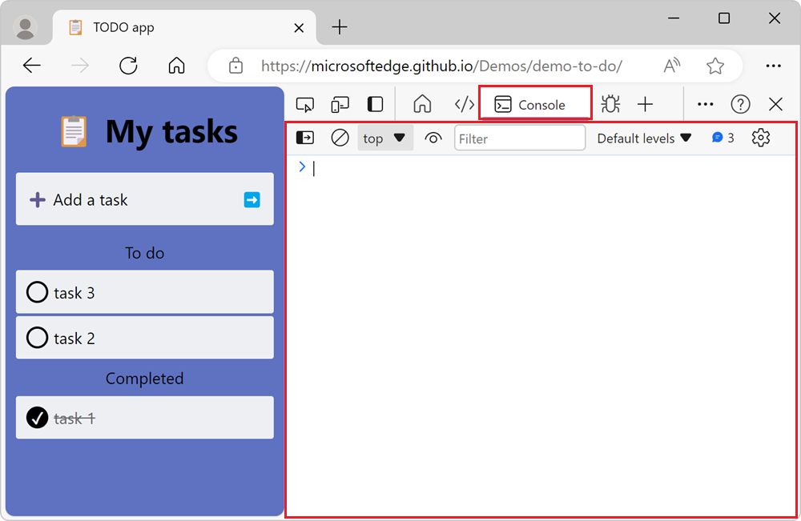

<!-- ------------------------------ -->
#### Open the Console tool in the Quick View toolbar

To open the **Console** tool in the **Quick View** toolbar, at the bottom of the DevTools window, press **Esc**. If the **Quick View** toolbar was previously hidden, it appears:

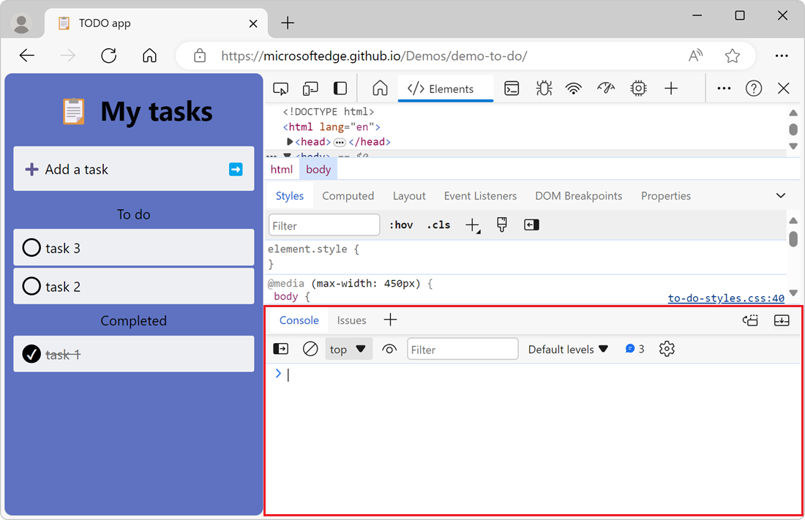

Or, click **Customize and control DevTools** (`...`) > **Toggle Quick View panel**.

<!-- ------------------------------ -->
#### Open the Console from the Command Menu

To open the **Console** tool from the **Command Menu**:

1. Press **Ctrl+Shift+P** (Windows, Linux) or **Command+Shift+P** (macOS).

   The Command Menu initially opens with a `>` character prepended to its text box.

1. Type **Show Console** and then select either of the **Show Console** options:

   * To open the **Console** in the **Activity Bar**, select the option with the **Panel** badge next to it.
   * To open the **Console** in the **Quick View** toolbar, select the option with the **Quick View** badge next to it.

   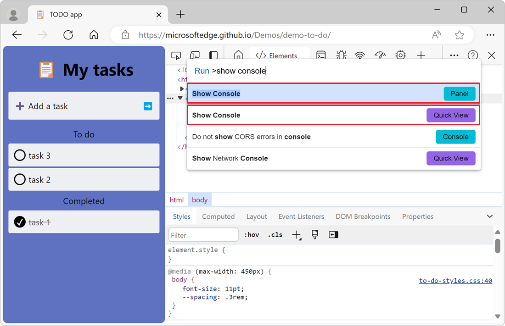

To learn more about the **Command Menu**, see [Run commands in the Command Menu](../command-menu/index.md).

<!-- ------------------------------ -->
#### Open Console Settings

To change settings of the **Console** tool, click the **Console settings** () button. The settings section appears:

<!-- ------------------------------ -->
#### Open the sidebar to filter messages

To display the sidebar in the **Console**, to filter messages, click **Show console sidebar** (). The sidebar appears:

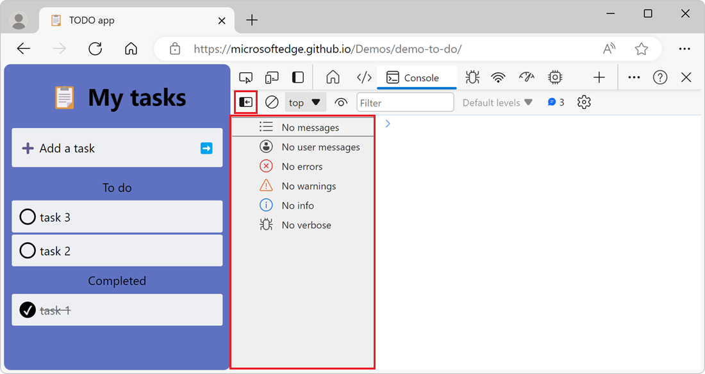

To learn more about filtering messages in the **Console** tool, see [Filter messages](#filter-messages).

<!-- ====================================================================== -->
## View messages

This following sections describe features that change how messages are presented in the **Console** tool.  For a hands-on walkthrough, see [Inspect and filter information on the current webpage](./index.md#inspect-and-filter-information-on-the-current-webpage) in _Console overview_.

<!-- ------------------------------ -->
#### Turn off message grouping

By default, the **Console** groups similar messages together.  For example, if multiple subsequent messages are logged, only one message is displayed in the **Console**.  The message includes a count of how many times the message was logged, and you can expand the message to see all the instances.

To turn off the default message grouping behavior of the **Console**, click the **Console settings** () button and then select the **Group similar messages in console** checkbox.

<!-- ------------------------------ -->
#### Log XHR and Fetch requests

To log all the network requests that are triggered by the `XMLHttpRequest` and `Fetch` JavaScript APIs:

1. Open the demo webpage [Inspect Network Activity Demo](https://microsoftedge.github.io/Demos/network-tutorial/) in a new window or tab.

1. In the **Console** tool, click the **Console Settings** () button, and then elect the **Log XMLHttpRequests** checkbox.

1. In the rendered webpage, click **Get Data** to trigger a `Fetch` API request. The **Console** logs the request and response details:

   

<!-- ------------------------------ -->
#### Persist messages across page loads

When you load a new webpage, the messages in the **Console** are cleared.  To persist messages across page loads, click the **Console Settings** () button and then select the **Preserve log** checkbox.

<!-- ------------------------------ -->
#### Hide network errors

By default, the **Console** tool logs network errors. For example, the following figure shows a network error message in the **Console** tool. The error is due to an HTTP response with the status code of `404`:

To hide network errors, click the **Console Settings** () button, and then select the **Hide network** checkbox.

<!-- ------------------------------ -->
#### Explain Console errors and warnings using Copilot in Edge

When inspecting a webpage with DevTools, you often see errors and warnings in the **Console** tool. These errors and warnings can sometimes be difficult to understand and fix. By using the **Explain this error** feature, you get more information about the error or warning in Copilot in Edge:

To learn more about this feature, see [Explain Console errors and warnings using Copilot in Edge](./copilot-explain-console.md).

<!-- ====================================================================== -->
## Filter messages

There are multiple ways to filter out messages in the **Console**.

<!-- ------------------------------ -->
#### Filter out browser messages

To only display messages that came from the JavaScript of the webpage:

1. Open the demo webpage [PWAmp](https://microsoftedge.github.io/Demos/pwamp/) in a new window or tab, and then click the **Play** button.

   The demo webpage logs messages to the **Console** and several browser messages are also logged:

   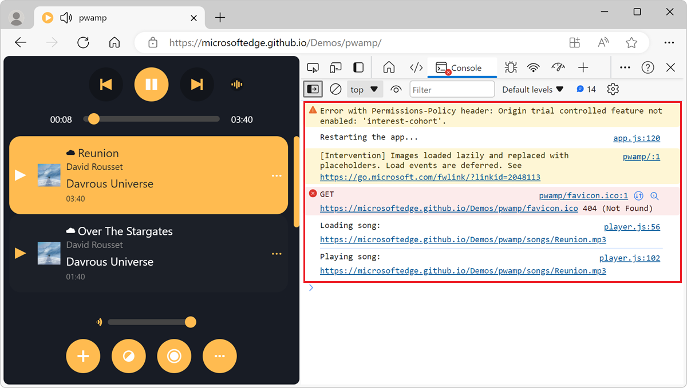

1. In the **Console** tool, to display the sidebar, click **Show console sidebar** ().

1. In the sidebar, click **3 user messages**. The number of user messages might vary depending on the number of messages that the webpage logs.

   The **Console** tool only displays the messages that the webpage logs, and the browser messages are hidden:

   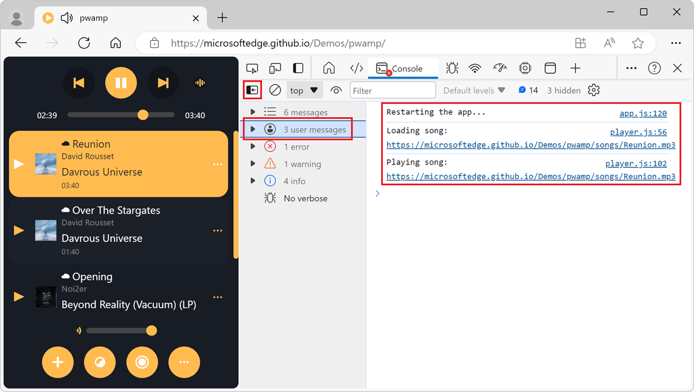

<!-- ------------------------------ -->
#### Filter by log level

DevTools assigns each message logged to the **Console** tool one of the four severity levels:

*  `Error`
*  `Info`
*  `Verbose`
*  `Warning`

The four severity levels apply to:

* Messages that you log from your webpage by using `console` methods such as `console.log()`, `console.error()`, and `console.warn()`.
* Messages that the browser logs.

You can hide any level of messages that you're not interested in.  For example, if you're only interested in `Error` messages, you can hide the other three levels.

To filter messages by level:

1. In the toolbar of the **Console** tool, click the **Log level** dropdown list.

   If the dropdown list isn't available, first hide the sidebar by clicking **Hide console sidebar** ().

1. In the dropdown list, enable or disable any of the `Verbose`, `Info`, `Warnings`, or `Errors` levels:

   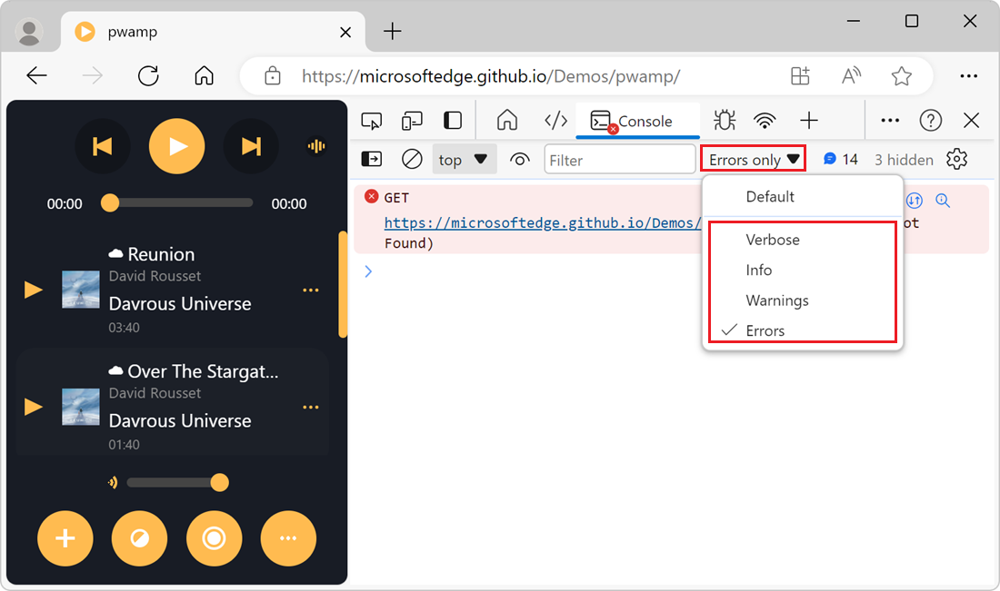

<!-- ------------------------------ -->
#### Filter messages by script URL

To filter messages by the URL of the script that logged the messages, use the **Filter** text box:

1. Open the demo webpage [PWAmp](https://microsoftedge.github.io/Demos/pwamp/) in a new window or tab. Messages from various scripts are logged to the **Console**.

1. In the toolbar of the **Console** tool, click the **Filter** text box, and then type `url:`. A dropdown list containing the URLs of the scripts that logged messages appears:

   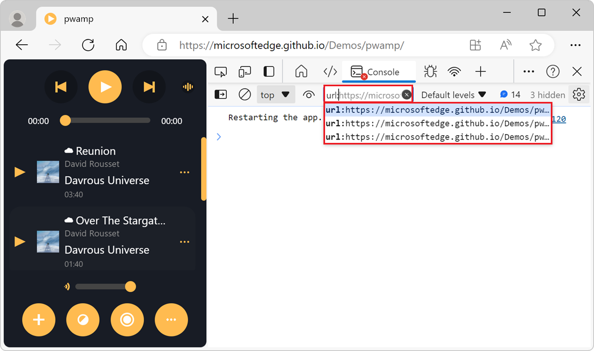

1. Select the URL of the script that you want to focus on. The **Console** tool only displays messages from that script:

   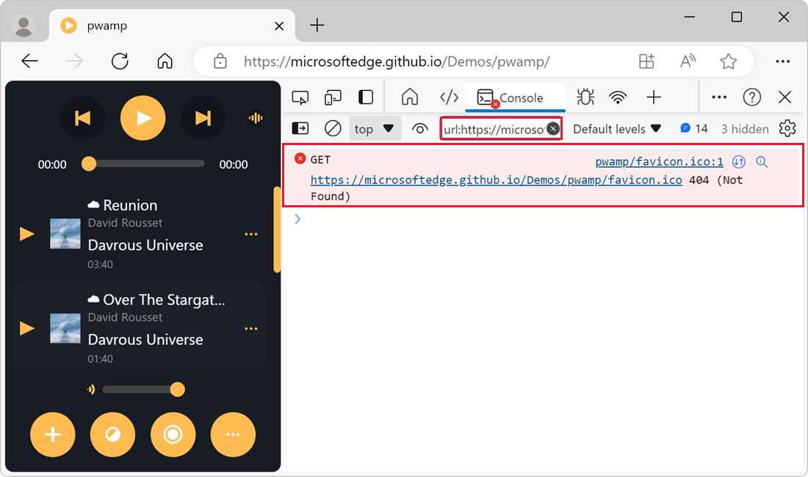

You don't have to choose from the list of URLs that the **Console** tool provides in the **Filter** dropdown list. You can type the URL, or part of the URL, that you want to filter by. For example, if `https://example.com/a.js` and `https://example.com/b.js` are logging messages, `url:example.com` allows you to focus on the messages from these two scripts.

###### Reverse the filter with a negative URL filter

To hide messages logged from a script, in the **Filter** text box, type `-url:` followed by the URL, or part of the URL, of the script. For example, to hide messages from `https://example.com/a.js`, type `-url:example.com/a.js`.

###### Display messages from a single script by using the sidebar

To display messages from a single script, by using the sidebar:

1. To display the sidebar in the **Console**, click **Show console sidebar** (). The sidebar appears.

1. Expand the **3 user messages** section. The number might vary depending on the number of messages that the webpage logs. The list of scripts that logged messages appears.

1. Select the script script that contains the messages that you want to focus on. The **Console** only displays messages from that script:

   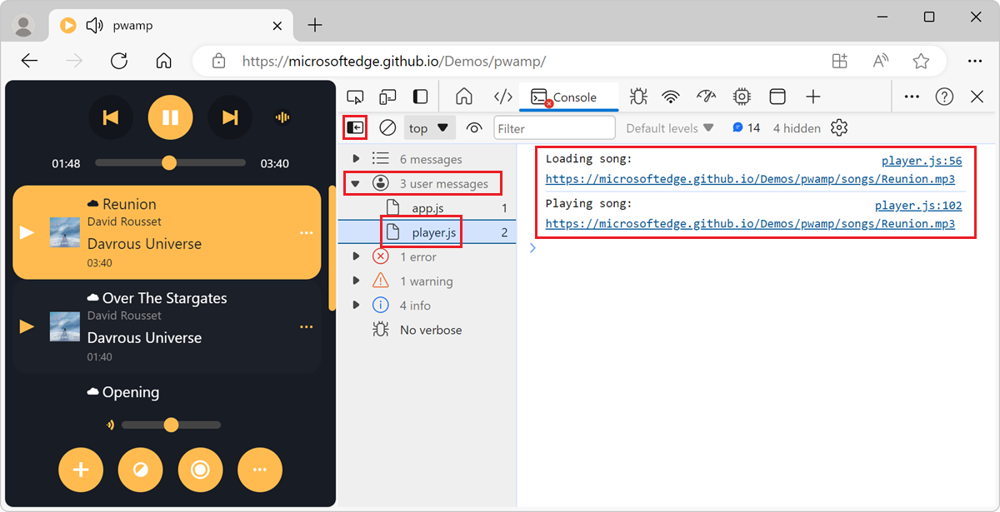

<!-- ------------------------------ -->
#### Filter out messages from different JavaSript contexts

By default, the **Console** tool displays messages from all the JavaScript contexts that are running on the webpage. This might include messages from cross-domain `<iframe>` elements that are embedded in the webpage, or service workers that are running in the background.

To only display messages from one JavaScript context:

1. Click the **Console Settings** () button. The settings section appears.

1. Select the **Selected context only** checkbox. Only the messages that are logged by the **top** JavaScript context are displayed in the **Console**.

1. To choose a difference context, in the toolbar of the **Console** tool, click the **JavaScript context** dropdown list, and then select the context that you want to focus on:

   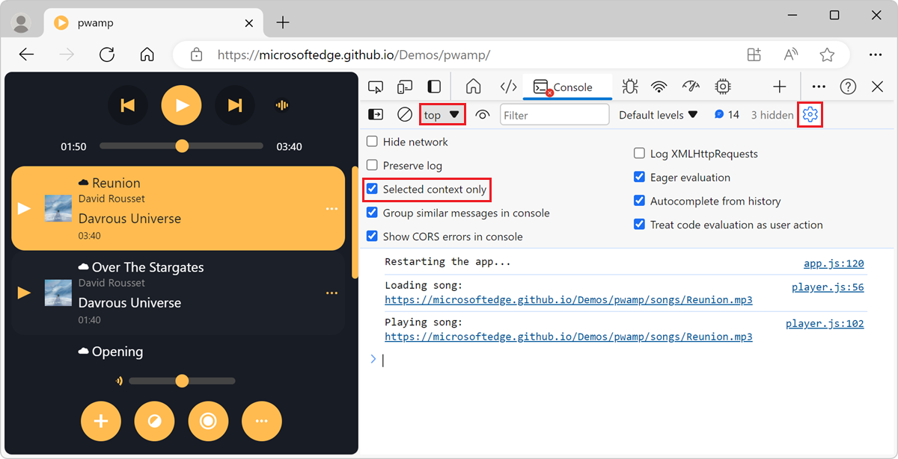

To learn more about selecting other JavaScript context, see [Select a JavaScript context](#select-a-javascript-context).

<!-- ------------------------------ -->
#### Filter messages by using a regular expression pattern

To only display the messages that match a regular expression pattern:

1. In the toolbar of the **Console** tool, click the **Filter** text box.

1. Type a regular expression pattern, such as `/.*\.mp3$/` to match messages that end with **.mp3**.

   The **Console** only shows the message that match the regular expression pattern:

  

<!-- ====================================================================== -->
## Run JavaScript

This section contains features related to running JavaScript in the **Console**.  For a hands-on walkthrough, see [Run JavaScript in the Console](console-javascript.md).

<!-- ------------------------------ -->
#### Run expressions again by using the Console history

To run an JavaScript expression that you ran earlier in the **Console**:

1. Press **Up Arrow** to cycle through the history of the JavaScript expressions that you ran earlier.

1. Press **Enter** to run the expression again.

<!-- ------------------------------ -->
#### Watch the value of an expression in real time by using a live expression

To watch the value of a JavaScript expression in real-time, instead of running the expression repeatedly, create a live expression:

1. In the toolbar of the **Console** tool, click the **Create live expression** button (). The **Expression** text box appears below the toolbar.

1. Enter a JavaScript expression, and then click outside of the **Expression** text box. The new expression and its value appear at the top of the **Console** tool.

For more information, see [Monitor changes in JavaScript using Live Expressions](./live-expressions.md).

<!-- ------------------------------ -->
#### Disable evaluating JavaScript expressions as you type

By default, the **Console** tool displays a preview of the value of an expression, as you type the JavaScript expression in the **Console**.

To turn off the live preview as you type: 

1. Click the **Console Settings** () button.

1. Clear the **Eager evaluation** checkbox.

<!-- ------------------------------ -->
#### Turn off autocomplete from history

When you type a JavaScript expression in the **Console** tool, an autocomplete popup window appears. The autocomplete popup window contains:

* Suggestions for global JavaScript objects and functions that match the characters that you've typed.
* Suggestions for JavaScript expressions that you ran earlier.

The suggestions for JavaScript expressions that you ran earlier are prefixed with the `>` character and appear at the bottom of the autocomplete window:

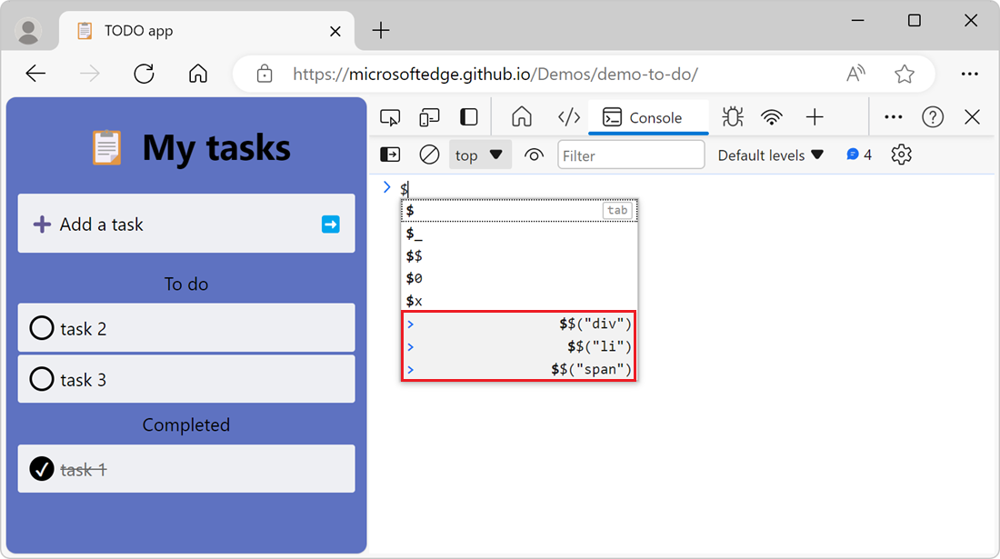

To stop displaying suggestions from your previously ran expressions:

1. Click the **Console Settings** () button.

1. Clear the **Autocomplete from history** checkbox.

<!-- ------------------------------ -->
#### Select a context to run JavaScript expressions

Webpages have a main [browsing context](https://developer.mozilla.org/docs/Glossary/Browsing_context) where the webpage's JavaScript runs. However, webpages can have additional JavaScript contexts, such as cross-domain `<iframe>` elements that are embedded in the webpage, or service workers that are running in the background.

By default, the **JavaScript context** dropdown list that's located in the toolbar of the **Console** tool is set to **top**, which represents the main webpage's browsing context:

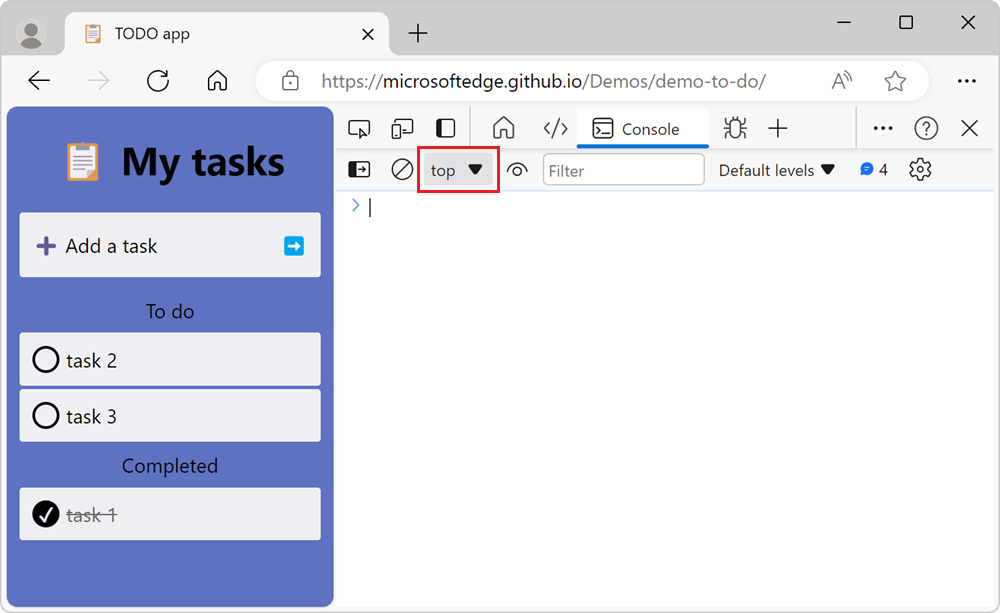

Any JavaScript expression that you run in the **Console** tool is evaluated in the context that's selected in the **JavaScript context** dropdown list.

To run JavaScript expressions in a different context, such as within a cross-domain `<iframe>` element, click the **JavaScript context** dropdown list, and then select another browsing context.

<!-- ====================================================================== -->
## Clear the Console

To clear the **Console**, use any of the following approaches:

*  Click the **Clear console** () button.

*  Right-click a message and then select **Clear console**.

*  Type `clear()` in the **Console** tool and then press **Enter**.

*  Call `console.clear()` from your webpage's JavaScript.

*  Press **Ctrl+L** while the **Console** tool is in focus.

<!-- ====================================================================== -->
## See also

<!-- if an article's title is adequately descriptive, and the article is in the same TOC bucket as the present article, don't much need a link here: -->
* [Log messages in the Console tool](console-log.md) - How to filter log messages such as Info, Warnings, and Errors in the Console.
* [Get started with running JavaScript in the Console](console-javascript.md) - Steps to walk you through issuing JavaScript statements and expressions in the Console.
* [Console object API Reference](api.md) - Functions and expressions that you can enter in the Console to write messages to the Console, such as `console.log()`.
* [Console tool utility functions and selectors](utilities.md) - Convenience functions that you can enter in the **Console** tool, such as`monitorEvents()`.

<!-- ====================================================================== -->
> [!NOTE]
> Portions of this page are modifications based on work created and [shared by Google](https://developers.google.com/terms/site-policies) and used according to terms described in the [Creative Commons Attribution 4.0 International License](https://creativecommons.org/licenses/by/4.0).
> The original page is found [here](https://developer.chrome.com/docs/devtools/console/reference/) and is authored by [Kayce Basques](https://developers.google.com/web/resources/contributors#kayce-basques) (Technical Writer, Chrome DevTools \& Lighthouse).

This work is licensed under a [Creative Commons Attribution 4.0 International License](https://creativecommons.org/licenses/by/4.0).
