<!-- Copyright Kayce Basques

   Licensed under the Apache License, Version 2.0 (the "License");
   you may not use this file except in compliance with the License.
   You may obtain a copy of the License at

       https://www.apache.org/licenses/LICENSE-2.0

   Unless required by applicable law or agreed to in writing, software
   distributed under the License is distributed on an "AS IS" BASIS,
   WITHOUT WARRANTIES OR CONDITIONS OF ANY KIND, either express or implied.
   See the License for the specific language governing permissions and
   limitations under the License.  -->
# Console tool utility functions and selectors
<!-- orig:
# Console Utilities API reference
-->

The Console Utilities API contains a collection of convenience variables and functions for performing common tasks, such as:

*  Selecting and inspecting DOM elements.
*  Displaying data in a readable format.
*  Stopping and starting the profiler.
*  Monitoring DOM events.

These variables and functions only work by entering them directly into the DevTools **Console**; you can't use the variables and call the functions from scripts.


<!-- ====================================================================== -->
## Summary

| Variable or function | Description |
|---|---|
| [Recently evaluated expression: $_](#recently-evaluated-expression-_) | Returns the value of the most recently evaluated expression. |
| [Recently selected element or JavaScript object: $0-$4](#recently-selected-element-or-javascript-object-0-4) | Returns a recently selected element or JavaScript object. |
| [Query selector: $(selector)](#query-selector-selector) | Query selector; returns the reference to the first DOM element with the specified CSS selector, like `document.querySelector()`. |
| [Query selector all: \$\$(selector, \[startNode\])](#query-selector-all-selector-startnode) | Query selector all; returns an array of elements that match the specified CSS selector, like `document.querySelectorAll()`. |
| [XPath: \$x(path, \[startNode\])](#xpath-xpath-startnode) | Returns an array of DOM elements that match the specified XPath expression. |
| [clear()](#clear) | Clears the console of its history. |
| [copy(object)](#copyobject) | Copies a string representation of the specified object to the clipboard. |
| [debug(function)](#debugfunction) | When the specified function is called, the debugger is invoked and breaks inside the function on the Sources panel. |
| [dir(object)](#dirobject) | Displays an object-style listing of all of the properties for the specified object, like `console.dir()`. |
| [dirxml(object)](#dirxmlobject) | Prints an XML representation of the specified object, as displayed in the **Elements** tool, like `console.dirxml()`. |
| [inspect(object/function)](#inspectobjectfunction) | Opens and selects the specified DOM element in the **Elements** tool, or the specified JavaScript heap object in the **Memory** tool. |
| [getEventListeners(object)](#geteventlistenersobject) | Returns the event listeners that are registered on the specified object. |
| [keys(object)](#keysobject) | Returns an array containing the names of the properties belonging to the specified object. |
| [monitor(function)](#monitorfunction) | Logs a message to the console that indicates the function name, along with the arguments passed to the function as part of a request. |
| [monitorEvents(object[, events])](#monitoreventsobject-events) | When one of the specified events occurs on the specified object, the event object is logged to the console. |
| [profile([name])](#profilename) | Starts a JavaScript CPU profiling session with an optional name. |
| [profileEnd([name])](#profileendname) | Completes a JavaScript CPU profiling session and displays the results in the **Performance** tool. |
| [queryObjects(constructor)](#queryobjectsconstructor) | Returns an array of the objects that were created by the specified constructor. |
| [table(data[, columns])](#tabledata-columns) | Logs object data, formatted as a table with column headings, for the specified data object. |
| [undebug(function)](#undebugfunction) | Stops the debug of the specified function, so that when the function is requested, the debugger is no longer invoked. |
| [unmonitor(function)](#unmonitorfunction) | Stops the monitoring of the specified function. |
| [unmonitorEvents(object[, events])](#unmonitoreventsobject-events) | Stops monitoring events for the specified object and events. |
| [values(object)](#valuesobject) | Returns an array containing the values of all properties belonging to the specified object. |


<!-- ====================================================================== -->
## Recently evaluated expression: $_

<!-- summary bubbled up to Summary table: -->
`$_` returns the value of the most recently evaluated expression.

**Syntax:**

```javascript
$_
```

#### Example 1

1. Press **Ctrl+Shift+J** (Windows, Linux) or **Command+Option+J** (macOS).  The **Console** tool opens in DevTools, next to the webpage.

1. In the **Console** tool, type the expression `2+2`, and then press **Enter**.

   The expression is evaluated, and the result is shown. The `$_` variable is also set to the result of the expression.

1. Type `$_`, and then press **Enter**:

   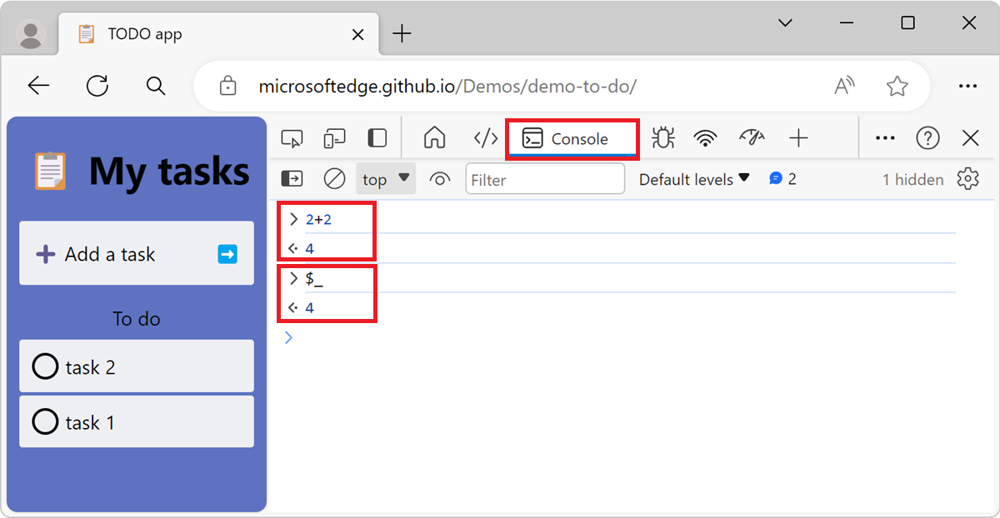

#### Example 2

1. Press **Ctrl+Shift+J** (Windows, Linux) or **Command+Option+J** (macOS).  The **Console** tool opens in DevTools, next to the webpage.

1. Paste the following code into the **Console**, and then press **Enter**:

   ```javascript
   ["john", "paul", "george", "ringo"]
   ```

   The evaluated expression is an array of names.

1. Type the following code into the **Console**, and then press **Enter**:

   ```javascript
   $_.length
   ```

   The expression `$_.length` is evaluated and `4` is shown in the **Console** because `$_` refers to the previously evaluated expression, which is the array of names. `$_.length` is the length of the array of names.

1. Type the following code into the **Console**, and then press **Enter**:

   ```javascript
   $_
   ```

   `$_` always refers to the previously evaluated expression, which is now the number 4.

   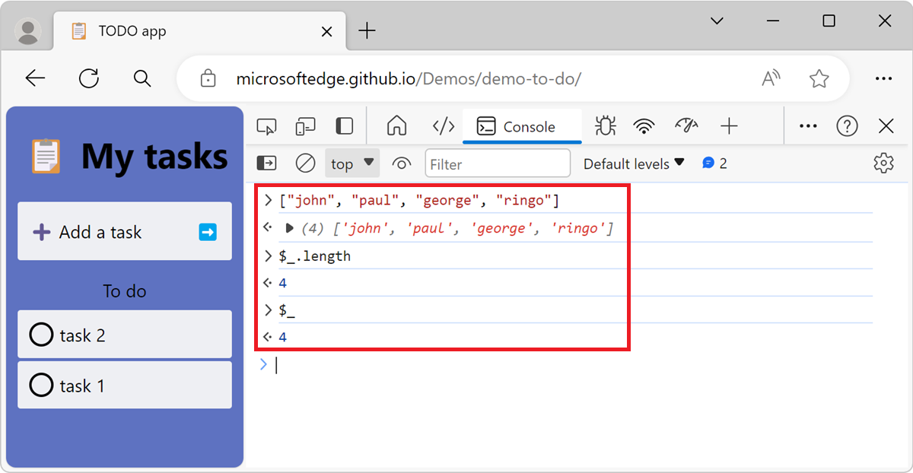


<!-- ====================================================================== -->
## Recently selected element or JavaScript object: $0-$4

<!-- summary bubbled up to Summary table: -->
`$0`, `$1`, `$2`, `$3`, and `$4` return recently selected elements or JavaScript objects.

<!-- add'l info -->
`$0` returns the most recently selected element or JavaScript object, `$1` returns the second most recently selected one, and so on.  The `$0`, `$1`, `$2`, `$3`, and `$4` variables work as a historical reference to the last five DOM elements that were inspected within the **Elements** tool, or the last five JavaScript heap objects that were selected in the **Memory** tool.

#### Syntax

```javascript
$0
```

#### Example

1. To open DevTools, right-click the webpage, and then select **Inspect**.  Or, press **Ctrl+Shift+I** (Windows, Linux) or **Command+Option+I** (macOS).  DevTools opens.

1. In the **Elements** tool, select an element, for example an `<input>` element.

1. Open the **Console** tool in the **Quick View** panel, at the bottom of DevTools.

1. Type `$0` in the **Console** tool, and then press **Enter**.

   The `$0` variable returns the selected `<input>` element:

   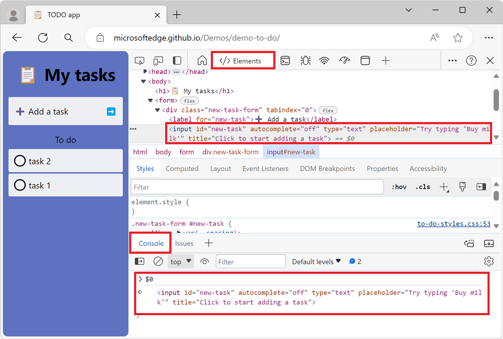

1. Select a different element in the **Elements** tool, for example a `<div>` element.

1. In the **Console** tool, type `$0`, and then press **Enter**.

   `$0` refers to the newly selected element, which is the `<div>` element.

1. Type `$1`, and then press **Enter**.

   `$1` refers to the previously selected element, which is the `<input>` element:

   


<!-- ====================================================================== -->
## Query selector: $(selector)

<!-- summary bubbled up to Summary table: -->
`$(selector)` returns the reference to the first DOM element that matches the specified CSS selector `selector`.

<!-- add'l info -->
This function is similar to the [document.querySelector()](https://developer.mozilla.org/docs/Web/API/Document/querySelector) function.

If you are using a library such as jQuery that uses `$`, the functionality is overwritten, and `$` corresponds to the implementation from that library.

#### Syntax

```javascript
$(selector, [parentElement])
```

#### Example 1

1. Press **Ctrl+Shift+J** (Windows, Linux) or **Command+Option+J** (macOS).  The **Console** tool opens in DevTools, next to the webpage.

1. In the **Console** tool, type `$('input')`. The first element that matches the `input` CSS selector is displayed:

   

1. Right-click the returned result and then select **Reveal in Elements Panel** to find it in the DOM, or **Scroll in to View** to show it on the page.

#### Example 2

The `$()` function accepts a second parameter, `parentElement`, that specifies a parent element which to search in. The default value of the parameter is `document`, which means that the entire webpage is searched by default. By specifying a parent element, you can search for elements within a specific part of the webpage.

1. Press **Ctrl+Shift+J** (Windows, Linux) or **Command+Option+J** (macOS).  The **Console** tool opens in DevTools, next to the webpage.

1. In the **Console** tool, type `$('input', $('ul'))`

   The first element that matches the `input` CSS selector found within the first `ul` element is retruned:

   


<!-- ====================================================================== -->
## Query selector all: \$\$(selector, \[startNode\])

<!-- summary bubbled up to Summary table: -->
`$$()` returns a list of elements that match the specified CSS selector, like `document.querySelectorAll()`.

<!-- add'l info -->
This function is similar to [document.querySelectorAll()](https://developer.mozilla.org/docs/Web/API/Document/querySelectorAll) but returns an `array` of element, instead of a `NodeList`.

#### Syntax

```javascript
$$(selector, [parentElement])
```

#### Example 1

1. Press **Ctrl+Shift+J** (Windows, Linux) or **Command+Option+J** (macOS).  The **Console** tool opens in DevTools, next to the webpage.

1. In the **Console** tool, type `$$('button')`. All the `<button>` elements in the webpage are displayed:

   

#### Example 2

This `$$()` function also supports a second parameter, `parentElement`, that specifies a parent element which to search in. The default value of the parameter is `document`, which means that the entire webpage is searched by default. By specifying a parent element, you can search for elements within a specific part of the webpage.

1. Press **Ctrl+Shift+J** (Windows, Linux) or **Command+Option+J** (macOS).  The **Console** tool opens in DevTools, next to the webpage.

1. In the **Console** tool, type `$$('button', $('li.task'))`. All the `<button>` elements that are descendants of the first `<li class="task">` element are displayed:

   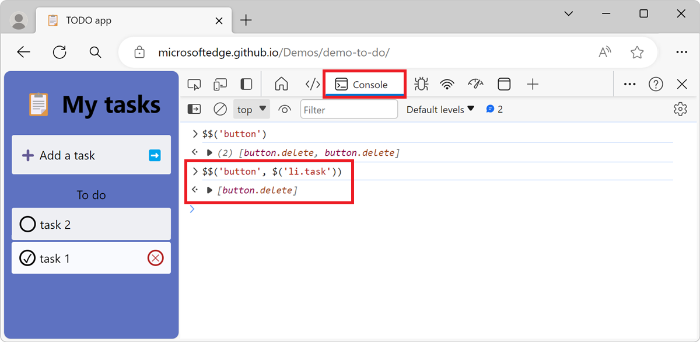


<!-- ====================================================================== -->
## XPath: \$x(path, \[startNode\])

<!-- summary bubbled up to Summary table: -->
`$x(path)` returns an array of DOM elements that match the specified XPath expression `path`.

<!-- add'l info: n/a -->

#### Syntax

```javascript
$x(path, [parentElement])
```

#### Example 1

1. Press **Ctrl+Shift+J** (Windows, Linux) or **Command+Option+J** (macOS).  The **Console** tool opens in DevTools, next to the webpage.

1. In the **Console** tool, type `$x("//li")`. All the `<li>` elements in the webpage are displayed:

   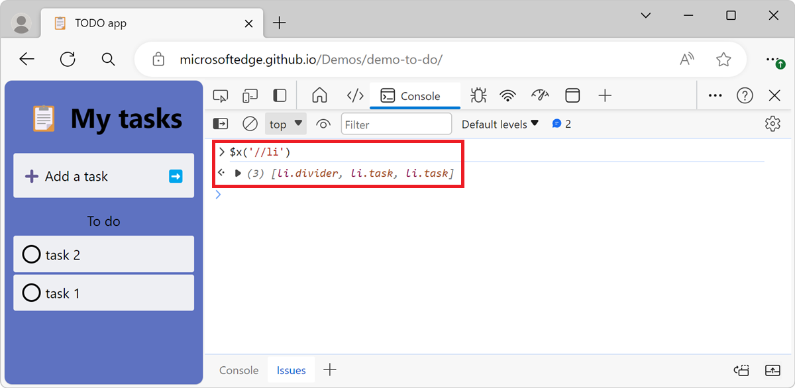

#### Example 2

1. Press **Ctrl+Shift+J** (Windows, Linux) or **Command+Option+J** (macOS).  The **Console** tool opens in DevTools, next to the webpage.

1. In the **Console** tool, type `$x("//li[button]")`. All the `<li>` elements that contain `<button>` elements are displayed:

   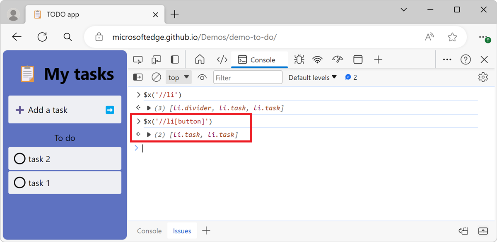

Similar to the other selector commands, `$x(path)` has an optional second parameter, `parentElement`, that specifies an element or node in which to search for elements.


<!-- ====================================================================== -->
## clear()

<!-- summary bubbled up to Summary table: -->
`clear()` clears the console of its history.

<!-- add'l info: n/a -->

#### Syntax

```javascript
clear()
```

#### Example

1. Press **Ctrl+Shift+J** (Windows, Linux) or **Command+Option+J** (macOS).  The **Console** tool opens in DevTools, next to the webpage.

1. To create history in the **Console** tool, enter multiple JavaScript expressions. For example:

   ```javascript
   for (let i = 0; i < 10; i++) {
       console.log(i);
   }
   ```

1. To clear the history, type `clear()` in the **Console** tool, and then press **Enter**:

   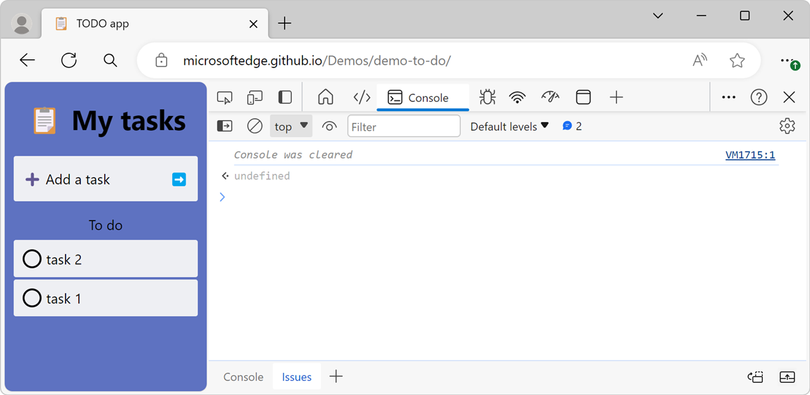


<!-- ====================================================================== -->
## copy(object)

<!-- summary bubbled up to Summary table: -->
`copy(object)` copies a string representation of the specified object to the clipboard.

<!-- add'l info: n/a -->

#### Syntax

```javascript
copy(object)
```

#### Example

1. Press **Ctrl+Shift+J** (Windows, Linux) or **Command+Option+J** (macOS).  The **Console** tool opens in DevTools, next to the webpage.

1. Enter the following code in the **Console** tool, and then press **Enter**:

   ```javascript
   copy($$('*').map(element => element.tagName));
   ```

   The code snippet selects all elements in the webpage by using the `$$(selector)` function, and then maps the `tagName` property of each element to an array. The array is then copied to the clipboard by using the `copy()` function.

1. Paste the contents of the clipboard into a text editor. The contents of the clipboard is a list of all the HTML tags in the webpage, for example:

   ```javascript
   ["HTML", "HEAD", "META", "TITLE", "LINK", "BODY", "H1", "FORM", "DIV", "LABEL", ...]
   ```


<!-- ====================================================================== -->
## debug(function)

<!-- summary bubbled up to Summary table: -->
`debug(function)` pauses  inside the specified function `function` in the **Sources** tool, when that function is called.

<!-- add'l info -->
After the debugger is paused, you can then step through the code and debug it.

#### Syntax

```javascript
debug(function)
```

#### Example

1. Open a new tab or window, and then go to a page that contains a JavaScript function you want to debug.  For example, go to the [TODO app](https://microsoftedge.github.io/Demos/demo-to-do/) demo page.

1. Press **Ctrl+Shift+J** (Windows, Linux) or **Command+Option+J** (macOS).  The **Console** tool opens in DevTools, next to the webpage.

1. In the **Console** tool, type `debug(updateList)`.

1. In the rendered webpage, add a new TODO item to the list by typing **test** in the **Add a task** text field and then pressing **Enter**.

   The debugger pauses inside the `updateList()` function in the **Sources** tool:

   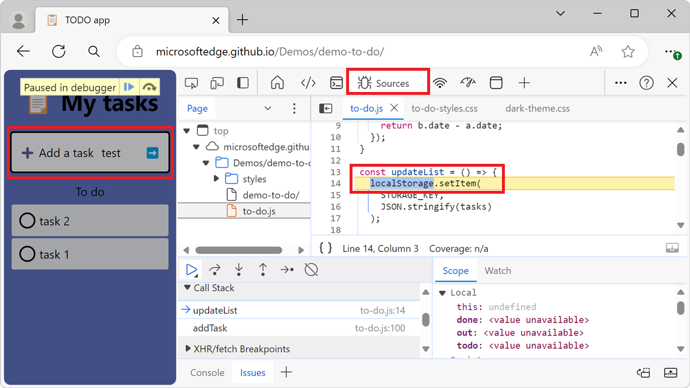

Use `undebug(function)` to stop breaking on the function, or use the UI to turn off all breakpoints.

For more information on breakpoints, see [Pause your code with breakpoints](../javascript/breakpoints.md).


<!-- ====================================================================== -->
## dir(object)

<!-- summary bubbled up to Summary table: -->
`dir(object)` displays an object-style listing of all of the properties for the specified object, like `console.dir()`.

<!-- add'l info -->
This function is an alias for [console.dir()](https://developer.mozilla.org/docs/Web/API/Console/dir).

#### Syntax

```javascript
dir(object)
```

#### Example

1. Press **Ctrl+Shift+J** (Windows, Linux) or **Command+Option+J** (macOS).  The **Console** tool opens in DevTools, next to the webpage.

1. In the **Console** tool, enter `document.head` and then press **Enter**.

   An HTML representation of the `<head>` element is displayed.

1. Enter `dir(document.head)` and then press **Enter**.

   An object-style listing of all of the properties for the `<head>` element is displayed:

   

For more information, see [console.dir()](api.md#dir) in the Console API.


<!-- ====================================================================== -->
## dirxml(object)

<!-- summary bubbled up to Summary table: -->
`dirxml(object)` prints an XML representation of the specified object, as displayed in the **Elements** tool, like `console.dirxml()`.

<!-- add'l info -->
This function is equivalent to [console.dirxml()](https://developer.mozilla.org/docs/Web/API/Console/dirxml).

#### Syntax

```javascript
dirxml(object)
```


<!-- ====================================================================== -->
## inspect(object/function)

<!-- summary bubbled up to Summary table: -->
`inspect(element/function)` opens and selects the specified DOM element in the **Elements** tool, or the specified JavaScript function in the **Sources** tool.

<!-- add'l info -->
* For a DOM element, this function opens and selects the specified DOM element in the **Elements** tool.
* For a JavaScript function, this function opens the specified JavaScript function in the **Sources** tool.

#### Syntax

```javascript
inspect(element/function)
```

#### Example

1. Press **Ctrl+Shift+J** (Windows, Linux) or **Command+Option+J** (macOS).  The **Console** tool opens in DevTools, next to the webpage.

1. In the **Console** tool, enter `inspect(document.body)` and then press **Enter**.

   The **Elements** tool opens and the `<body>` element is selected:

   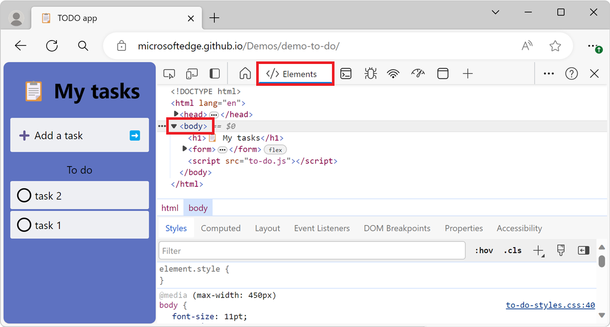

When passing a function to inspect, the function opens the webpage in the **Sources** tool for you to inspect.


<!-- ====================================================================== -->
## getEventListeners(object)

<!-- summary bubbled up to Summary table: -->
`getEventListeners(object)` returns the event listeners that are registered on the specified object.

<!-- add'l info -->
The return value is an object that contains an array for each registered event type (such as `click` or `keydown`).  The items in each array are objects that describe the listener registered for each type.

#### Syntax

```javascript
getEventListeners(object)
```

#### Example

1. Press **Ctrl+Shift+J** (Windows, Linux) or **Command+Option+J** (macOS).  The **Console** tool opens in DevTools, next to the webpage.

1. In the **Console** tool, enter `getEventListeners($('form'))` and then press **Enter**.

   The event listeners that are registered on the first `<form>` element are displayed:

   

If more than one listener is registered on the specified object, then the array contains a member for each listener.  In the following figure, two event listeners are registered on the `document` element for the `click` event:

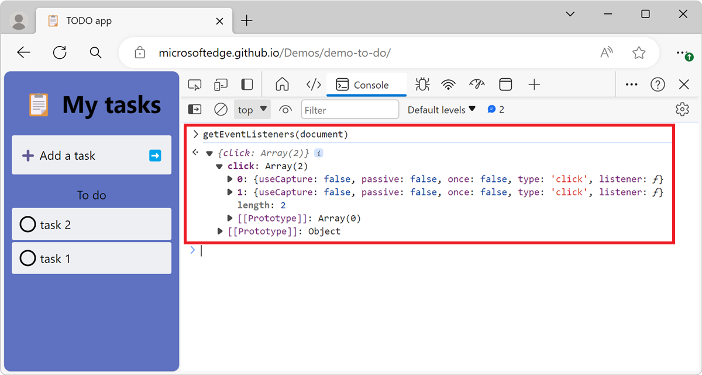


<!-- ====================================================================== -->
## keys(object)

<!-- summary bubbled up to Summary table: -->
`keys(object)` returns an array containing the names of the properties belonging to the specified object.

<!-- add'l info -->
To get the associated values of the same properties, see [values(object)](#valuesobject), below.

#### Syntax

```javascript
keys(object)
```

#### Example

1. Press **Ctrl+Shift+J** (Windows, Linux) or **Command+Option+J** (macOS).  The **Console** tool opens in DevTools, next to the webpage.

1. In the **Console** tool, enter the following code, and then press **Enter**:

   ```javascript
   var player1 = {"name": "Ted", "level": 42}
   ```

   The above code snippet defines an object in the global namespace named `player1`, which contains two properties.

1. To get the names of the properties belonging to the `player1` object, enter `keys(player1)` in the **Console** tool, and then press **Enter**:

   

1. To get the values of the properties belonging to the `player1` object, enter `values(player1)` in the **Console** tool, and then press **Enter**:

   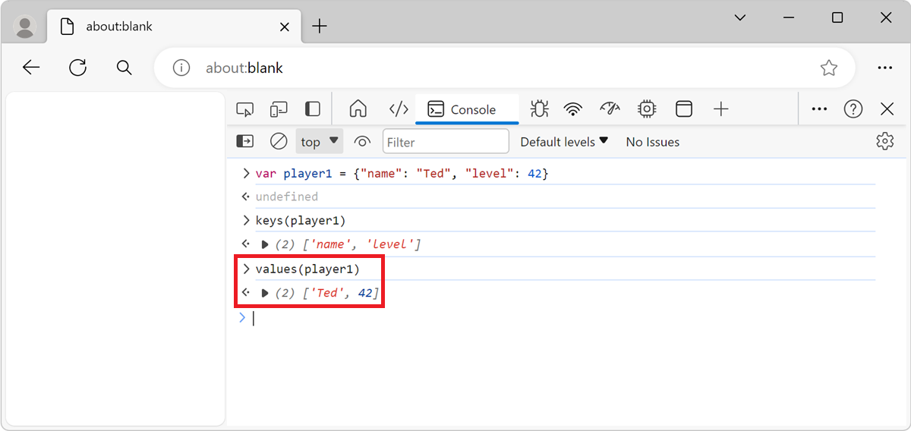


<!-- ====================================================================== -->
## monitor(function)

<!-- summary bubbled up to Summary table: -->
`monitor(function)` logs a message to the console everytime the specified function is called. The message indicates the function name and the arguments passed to the function.

<!-- add'l info: n/a -->

#### Syntax

```javascript
monitor(function)
```

#### Example

1. Press **Ctrl+Shift+J** (Windows, Linux) or **Command+Option+J** (macOS).  The **Console** tool opens in DevTools, next to the webpage.

1. In the **Console** tool, enter the following code and then press **Enter**:

   ```javascript
   function sum(x, y) {
     return x + y;
   }
   ```

   The above code snippet defines a function named `sum`, which accepts two arguments.

1. To start monitoring the `sum` function, enter `monitor(sum)` in the **Console** tool, and then press **Enter**:

1. To call the function, enter `sum(1, 2)` and press **Enter**. A message appears, indicating that the `sum` function was called, and the arguments passed to the function:

   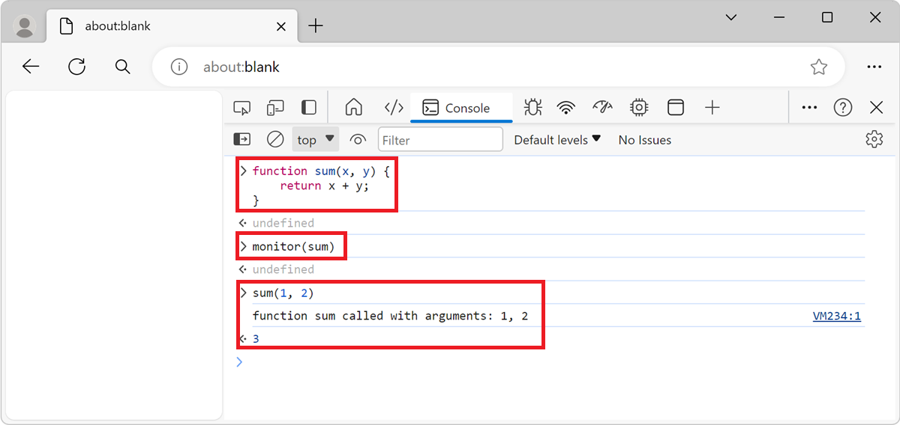

To end monitoring, use `unmonitor(function)`.


<!-- ====================================================================== -->
## monitorEvents(object\[, events\])

<!-- summary bubbled up to Summary table: -->
`monitorEvents(object[, events])` logs an event object to the console every time the specified events occur on the specified object.

<!-- add'l info -->
You can specify a single event to monitor, an array of events, or one of the generic events types that are mapped to a predefined collection of events.

#### Syntax

```javascript
monitorEvents(object[, events])
```

#### Example 1

To monitor a single event:

1. Press **Ctrl+Shift+J** (Windows, Linux) or **Command+Option+J** (macOS).  The **Console** tool opens in DevTools, next to the webpage.

1. In the **Console** tool, enter the following code and then press **Enter**:

   ```javascript
   monitorEvents(window, "resize");
   ```

   The previous code snippet monitors all resize events on the window object.

1. Resize the window, for example by making DevTools larger or smaller. Resize events appear in the **Console** tool:

   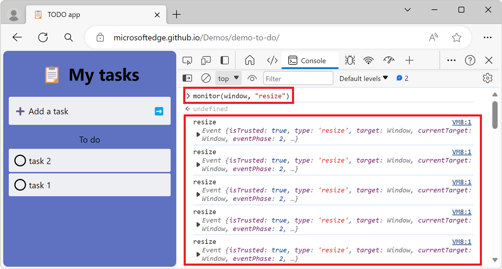

#### Example 2

To monitor multiple events:

1. Press **Ctrl+Shift+J** (Windows, Linux) or **Command+Option+J** (macOS).  The **Console** tool opens in DevTools, next to the webpage.

1. In the **Console** tool, enter the following code and then press **Enter**:

   ```javascript
   monitorEvents(window, ["resize", "scroll"]);
   ```

   The previous code snippet defines an array of event names to monitor both `resize` and `scroll` eevents on the window object.

1. Resize the window, for example by making it shorter, and then scroll in the rendered webpage. Resize and scroll events appear in the **Console** tool:

   

#### Example 3

You can also specify a collection of events by using one of the predefined sets of events.  The following table shows the available event types and the associated event mappings:

| Event type | Corresponding mapped events |
|:--- |:--- |
| `mouse` | "click", "dblclick", "mousedown", "mousemove", "mouseout", "mouseover", "mouseup", "mousewheel" |
| `key` | "keydown", "keypress", "keyup", "textInput" |
| `touch` | "touchcancel", "touchend", "touchmove", "touchstart" |
| `control` | "blur", "change", "focus", "reset", "resize", "scroll", "select", "submit", "zoom" |

1. Press **Ctrl+Shift+J** (Windows, Linux) or **Command+Option+J** (macOS).  The **Console** tool opens in DevTools, next to the webpage.

1. In the **Console** tool, enter the following code and then press **Enter**:

   ```javascript
   monitorEvents(window, "key");
   ```

   The previous code snippet monitors all keyboard events on the window object.

1. In the rendered webpage, press any keys. Keyboard events appear in the **Console** tool:

   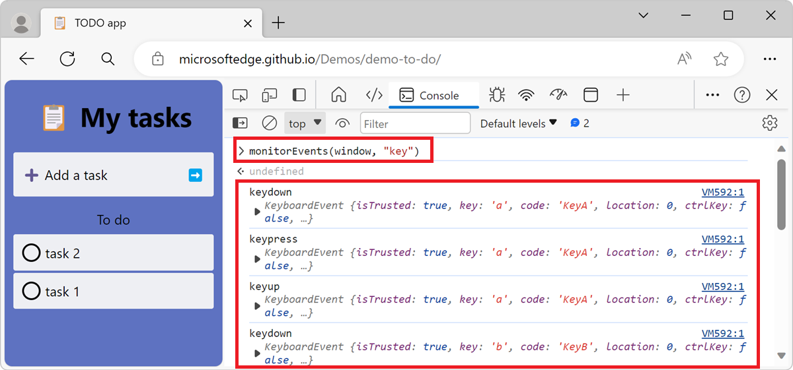


<!-- ====================================================================== -->
## profile([name])

<!-- summary bubbled up to Summary table: -->
`profile([name])` starts a JavaScript CPU profiling session with an optional name.

<!-- add'l info -->
To complete the profile and display the results in the **Performance** tool, call [profileEnd([name])](#profileendname).  <!-- See [Speed Up JavaScript Runtime](../rendering-tools/js-runtime.md).  -->

#### Syntax

```javascript
profile([name])
```

#### Example

1. Open the page that you want to profile in a new tab or window.  For example, go to the [Sluggish Animation](https://microsoftedge.github.io/Demos/devtools-performance-get-started/) demo page.

1. Press **Ctrl+Shift+J** (Windows, Linux) or **Command+Option+J** (macOS).  The **Console** tool opens in DevTools, next to the webpage.

1. To start profiling, in the **Console** tool, type `profile("My profile)`, and then press **Enter**.

1. To stop profiling, after some time has passed, type `profileEnd("My profile")`, and then press **Enter**.

   The profile results appear in the **Performance** tool:

   

You can create multiple profiles at the same time, and you aren't required to end each profile in creation order. For example, the following code creates two profiles, and then ends them in the opposite order:

```javascript
profile('A');
profile('B');
profileEnd('B');
profileEnd('A');
```


<!-- ====================================================================== -->
## profileEnd([name])

<!-- summary bubbled up to Summary table: -->
`profileEnd([name])` completes a JavaScript CPU profiling session and displays the results in the **Performance** tool.

<!-- add'l info -->
To call this function, you must be running the [profile([name])](#profilename) function.  <!-- See [Speed Up JavaScript Runtime](../rendering-tools/js-runtime.md).  -->

#### Syntax

```javascript
profileEnd([name])
```

For more information, see [profile([name])](#profilename), above.


<!-- ====================================================================== -->
## queryObjects(constructor)

<!-- summary bubbled up to Summary table: -->
`queryObjects(constructor)` returns an array of the objects that were created by the specified constructor.

<!-- add'l info -->
The scope of `queryObjects()` is the currently selected runtime context in the **Console**.

#### Syntax

```javascript
queryObjects(constructor)
```

#### Example

1. Press **Ctrl+Shift+J** (Windows, Linux) or **Command+Option+J** (macOS).  The **Console** tool opens in DevTools, next to the webpage.

1. To return all instances of HTML elements, enter `queryObjects(HTMLElement)` in the **Console** tool, and then press **Enter**:

   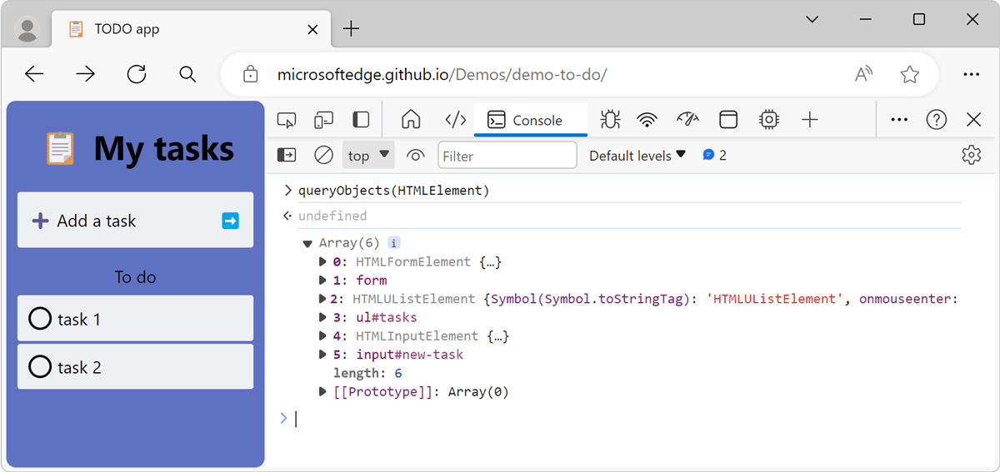

Other examples:

* Use `queryObjects(Promise)` to return all instances of `Promise` objects if your webpage uses `Promise` objects.
* Use `queryObjects(ClassName)` to return all instances of the `ClassName` class if your webpage uses JavaScript classes.


<!-- ====================================================================== -->
## table(data\[, columns\])

<!-- summary bubbled up to Summary table: -->
`table(data[, columns])` logs object data, formatted as a table with column headings, for the specified data object.

<!-- add'l info: n/a -->
This function is an alias for [console.table()](https://developer.mozilla.org/docs/Web/API/Console/table).

#### Syntax

```javascript
table(data[, columns])
```

#### Example

To display a list of people's names as a table, in the **Console**:

1. Press **Ctrl+Shift+J** (Windows, Linux) or **Command+Option+J** (macOS).  The **Console** tool opens in DevTools, next to the webpage.

1. Enter the following code in the **Console**, and then press **Enter**:

   ```javascript
   var names = {
     0: {
       firstName: "John",
       lastName: "Smith"
     },
     1:  {
       firstName: "Jane",
       lastName: "Doe"
     }
   };
   ```

   The above code snippet defines an object in the global namespace named `names`, which contains two properties.

1. To display the `names` object as a table, enter `table(names)` in the **Console**, and then press **Enter**:

   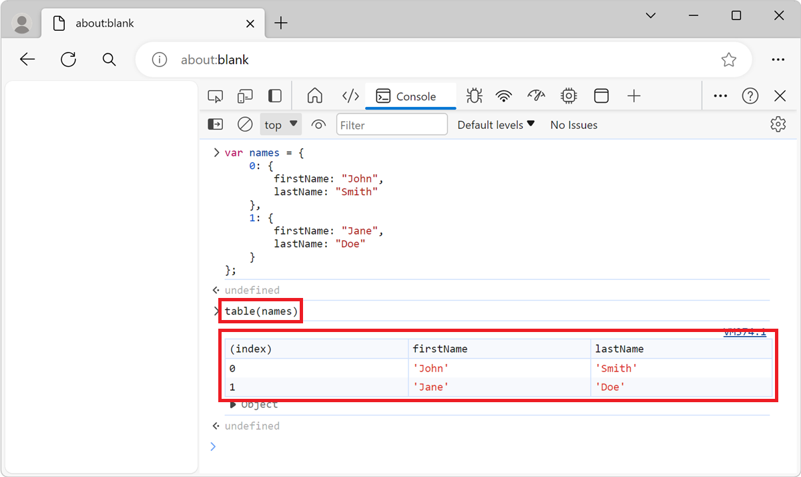


<!-- ====================================================================== -->
## undebug(function)

<!-- summary bubbled up to Summary table: -->
`undebug(function)` stops the debug of the specified function, so that when the function runs, the debugger no longer pauses in the function.

<!-- add'l info: n/a -->
For more information, see [debug(function)](#debugfunction), above.

#### Syntax

```javascript
undebug(function)
```


<!-- ====================================================================== -->
## unmonitor(function)

<!-- summary bubbled up to Summary table: -->
`unmonitor(function)` stops the monitoring of the specified function.

<!-- add'l info -->
For more information, see [monitor(function)](#monitorfunction), above.

#### Syntax

```javascript
unmonitor(function)
```


<!-- ====================================================================== -->
## unmonitorEvents(object\[, events\])

<!-- summary bubbled up to Summary table: -->
`unmonitorEvents(object[, events])` stops monitoring events for the specified object and events.

<!-- add'l info: n/a -->
For more information, see [monitorEvents(object[, events])](#monitoreventsobject-events), above.

#### Syntax

```javascript
unmonitorEvents(object[, events])
```


<!-- ====================================================================== -->
## values(object)

<!-- summary bubbled up to Summary table: -->
`values(object)` returns an array containing the values of all properties belonging to the specified object.

<!-- add'l info: n/a -->
To get the associated keys of the same properties, see [keys(object)](#keysobject), above.

#### Syntax

```javascript
values(object)
```

#### Example

See the example in [keys(object)](#keysobject), above.


<!-- ====================================================================== -->
## See also

<!-- if an article's title is adequately descriptive, and the article is in the same TOC bucket as the present article, don't much need a link here: -->
* [Console features reference](reference.md)
* [Console object API Reference](api.md) - `console.*` functions, such as `console.log()` and `console.error()`.


<!-- ====================================================================== -->
> [!NOTE]
> Portions of this page are modifications based on work created and [shared by Google](https://developers.google.com/terms/site-policies) and used according to terms described in the [Creative Commons Attribution 4.0 International License](https://creativecommons.org/licenses/by/4.0).
> The original page is found [here](https://developer.chrome.com/docs/devtools/console/utilities/) and is authored by [Kayce Basques](https://developers.google.com/web/resources/contributors#kayce-basques) (Technical Writer, Chrome DevTools \& Lighthouse).

[](https://creativecommons.org/licenses/by/4.0)
This work is licensed under a [Creative Commons Attribution 4.0 International License](https://creativecommons.org/licenses/by/4.0).
