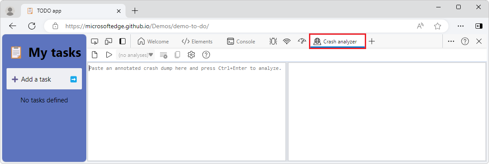
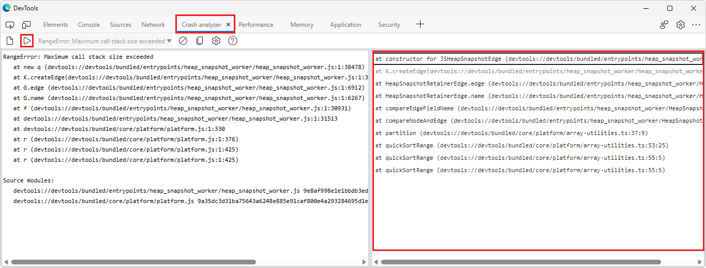

# Crash analyzer tool

Use the **Crash analyzer** tool to analyze Microsoft Edge<!--todo: review/expand--> crashes.  In the **Crash analyzer** tool, you can input a JavaScript stack trace, such as for non-fatal JavaScript exceptions, and then have your sourcemaps applied to the stack trace so that you can debug faster.

UI items:
* **New analysis** () button
* **Analyze** ( button
* **Analyses** ( dropdown list
* **Remove this analysis** () button
* **Copy unminified stack trace** () button
* **Open Symbol Server settings** () button
* **How to use** () button
* Left pane
* Right pane

<!-- ====================================================================== -->
## Reporting non-fatal JavaScript exceptions or similar data to tools

To report non-fatal JavaScript exceptions or similar data to tools such as Azure Application Insights:

1. First, in order to use the **Crash analyzer** tool, you need specially-formatted stack traces that include a section called `Source modules`.  This section contains the sourcemap references to the JavaScript functions that were part of the error stack trace.  You can produce these stack traces by using the [Crash Analyzer Support](https://www.npmjs.com/package/@microsoft/edge-devtools-crash-analyzer-support) npm package.

1. Then you need a way to actually receive the stack traces from the browsers that are running your code.  One such way is to use Azure Application Insights; see [Application Insights overview](/azure/azure-monitor/app/app-insights-overview).

1. Once you have a stack trace, paste it into the left pane of the **Crash analyzer** tool.

1. In the **Crash analyzer** tool, click the **Analyze** button (or press **Ctrl+Enter**).  The right-hand pane shows the original file and function names that make up the stack trace:

   

1. Click through the individual stack frames to see the lines in your original code that caused the error.

<!-- ====================================================================== -->
## Enabling the tool

As of March 1, 2024, this feature is hidden by default but is available in Stable and Beta, and is present on the **More Tools** menu in the Dev and Canary preview channels of Microsoft Edge.  To access the **Crash analyzer** tool in Microsoft Edge Stable or Beta, select the **Enable Crash Analyzer** experiment in **Settings** > **Experiments**.  See [Turning an experiment on or off](../experimental-features/index.md#turning-an-experiment-on-or-off) in _Experimental features in Microsoft Edge DevTools_.

<!-- ====================================================================== -->
## See also

* [Map the processed code to your original source code, for debugging](../javascript/source-maps.md) - source maps.
* [Debug JavaScript error stack traces by using the Crash Analyzer tool](../whats-new/2023/05/devtools-113.md#debug-javascript-error-stack-traces-by-using-the-crash-analyzer-tool) in _What's New in DevTools (Microsoft Edge 113)_.
* [throw - JavaScript | MDN Web Docs](https://developer.mozilla.org/docs/Web/JavaScript/Reference/Statements/throw)
* [Application Insights overview](/azure/azure-monitor/app/app-insights-overview)
* [Crash Analyzer Support | npm](https://www.npmjs.com/package/@microsoft/edge-devtools-crash-analyzer-support)
