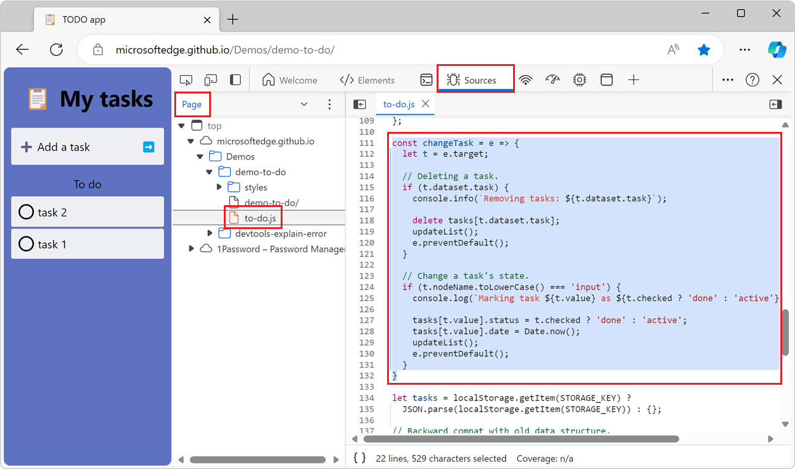
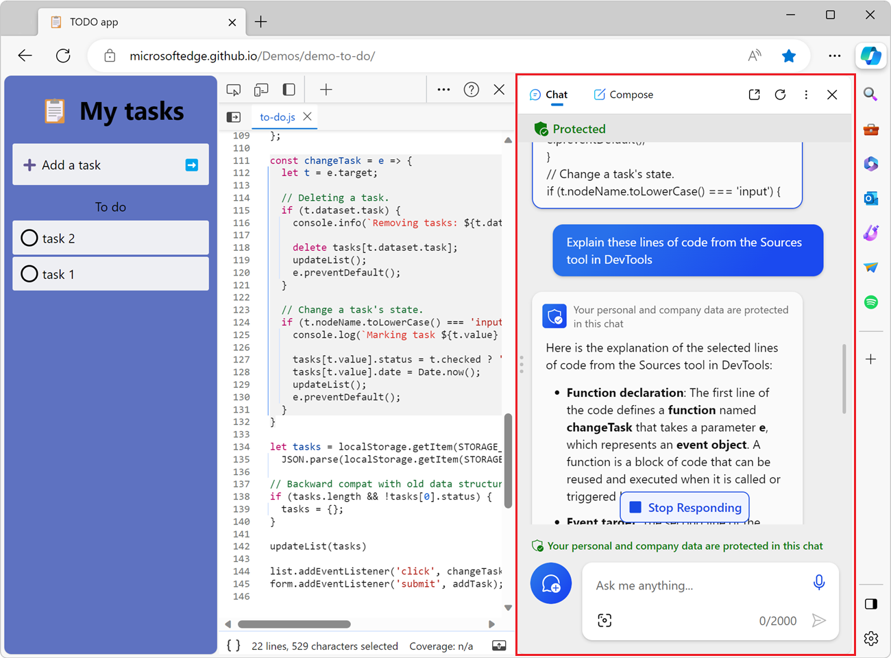

# Explain errors and source code in Copilot in Microsoft Edge

The **Console** and **Sources** tools in Microsoft Edge DevTools integrate with Copilot in Microsoft Edge to help you understand errors and source code. These are experimental features, enabled by a flag in Microsoft Edge.

<!-- ------------------------------ -->
#### The "Explain this error" feature

When inspecting a webpage with DevTools, you often see errors and warnings in the **Console** tool. These errors and warnings can sometimes be difficult to understand and fix. By using the **Explain this error** feature, you get more information about the error or warning in Copilot in Microsoft Edge.

<!-- ------------------------------ -->
#### The "Explain these lines of code" feature

When inspecting a webpage you didn't build, you might not be familiar with the source code displayed in the **Sources** tool. By using the **Explain these lines of code** feature, you get more information about the source code in Copilot in Microsoft Edge.

<!-- ====================================================================== -->
## Enable the features

To use these explanation features, enable Copilot in Microsoft Edge, set the flag to enable the features in DevTools, and use a standard browser window.

<!-- ------------------------------ -->
#### Enable Copilot in Microsoft Edge

To enable Copilot in Microsoft Edge:

1. Sign into Microsoft Edge. See [Sign in to sync Microsoft Edge across devices](https://support.microsoft.com/microsoft-edge/sign-in-to-sync-microsoft-edge-across-devices-e6ffa79b-ed52-aa32-47e2-5d5597fe4674).

1. Make sure the Copilot icon () is visible in the top-right corner of the browser toolbar. If it's not, in Microsoft Edge, select **Settings and more** (**...**) > **Settings** > **Sidebar** > **Copilot**, and then turn on the **Show Copilot** toggle.

<!-- ------------------------------ -->
#### Enable the feature in DevTools

To enable explanations of errors and source code in DevTools using Copilot:

1. In Microsoft Edge, go to `edge://flags` in a new tab or window.

1. Start typing **explain DevTools with AI**. The list of flags is filtered to show only the flag you're looking for.

1. In the **Explain DevTools with AI** flag, select **Enabled** from the dropdown, and then click **Restart** to restart the browser:

   

<!-- ------------------------------ -->
#### Use a standard browser window

The **Explain DevTools with AI** features are for use in standard browser windows, and are not available in the following scenarios:

* Browsing in an InPrivate window.  For information about InPrivate, see [Browse InPrivate in Microsoft Edge](https://support.microsoft.com/microsoft-edge/browse-inprivate-in-microsoft-edge-cd2c9a48-0bc4-b98e-5e46-ac40c84e27e2).
* Browsing with Kids Mode in Microsoft Edge.  For information about Kids Mode, see [Learn more about Kids Mode in Microsoft Edge](https://support.microsoft.com/microsoft-edge/learn-more-about-kids-mode-in-microsoft-edge-4bf0273c-1cbd-47a9-a8f3-895bc1f95bdd).
* Using DevTools with a Microsoft Edge WebView2 control.  For information about DevTools with WebView2 apps, see [Debug WebView2 apps with Microsoft Edge DevTools](../../webview2/how-to/debug-devtools.md).
* Using DevTools in a standalone Progressive Web App window.

<!-- ====================================================================== -->
## Explain errors and warnings in the Console tool

To explain an error or warning in the **Console** tool:

1. Open a web page that contains the errors you want to explain. For example, open the [Console error explainer test page](https://microsoftedge.github.io/Demos/devtools-explain-error/).

1. To open DevTools, right-click the webpage, and then select **Inspect**.  Or, press **Ctrl+Shift+I** (Windows, Linux) or **Command+Option+I** (macOS).  DevTools opens.

1. In DevTools, on the Activity Bar, select the **Console** tab.

1. In the rendered web page, click the **Run** button next to one or more error descriptions. The demo page generates errors when you click the **Run** buttons.
  
   The corresponding errors are shown in the **Console**:

   

1. In the **Console** tool, click the **ask Copilot: "Explain this error"** () button next to one of the error messages.

   Copilot opens in the Microsoft Edge sidebar, showing the error message, an **Explain the error message from DevTools console** request message, and then a response explaining the error:

   

1. To get more information about the error, in Copilot, enter additional questions.

<!-- ====================================================================== -->
## Explain source code in the Sources tool

To explain code in the **Sources** tool:

1. Open a web page that contains the source code you want to explain. For example, in a new window or tab, open the [TODO app](https://microsoftedge.github.io/Demos/demo-to-do/) demo page.

1. To open DevTools, right-click the webpage, and then select **Inspect**.  Or, press **Ctrl+Shift+I** (Windows, Linux) or **Command+Option+I** (macOS).  DevTools opens.

1. In DevTools, on the Activity Bar, select the **Sources** tab. If that tab isn't visible, click the **More tools** () button.

1. In the **Page** tab in the **Sources** tool, select the `to-do.js` file. The source code of that file appears in the Editor pane.

1. Select a few lines of code in the `to-do.js` file. For example, select the content of the `changeTask` function:

   

1. Right-click the selected text, and then select **Copilot: Explain these lines of code**.

   Copilot opens in the Microsoft Edge sidebar, showing the source code, an **Explain these lines of code from the Sources tool in DevTools** request message, and then a response explaining the source code:

   

1. To get more information about the source code, in Copilot, enter additional questions.

<!-- ====================================================================== -->
## Provide feedback

The responses that Copilot in Microsoft Edge provides when you use the above features are automatically generated, so surprises and mistakes are possible. We're constantly improving the level of quality and accuracy of the responses, but if you see an incorrect response, let us know by adding a comment at: [Feedback for the Explain errors and source code in Copilot in Edge experiment](https://github.com/MicrosoftEdge/DevTools/issues/203).
