<!-- Copyright Meggin Kearney

   Licensed under the Apache License, Version 2.0 (the "License");
   you may not use this file except in compliance with the License.
   You may obtain a copy of the License at

       https://www.apache.org/licenses/LICENSE-2.0

   Unless required by applicable law or agreed to in writing, software
   distributed under the License is distributed on an "AS IS" BASIS,
   WITHOUT WARRANTIES OR CONDITIONS OF ANY KIND, either express or implied.
   See the License for the specific language governing permissions and
   limitations under the License.  -->
# Record heap snapshots using the Memory tool

Use the heap profiler in the **Memory** tool to do the following:

*  Record JavaScript heap (JS heap) snapshots.
*  Analyze memory graphs.
*  Compare snapshots.
*  Find memory leaks.

The DevTools heap profiler shows memory distribution used by the JavaScript objects and related DOM nodes on the rendered webpage.

<!-- You can view the source files for the Heap Snapshots demo pages at the [MicrosoftEdge/Demos > devtools-memory-heap-snapshot](https://github.com/MicrosoftEdge/Demos/tree/main/devtools-memory-heap-snapshot) repo folder.

This article uses five demo webpages, all sourced at https://github.com/MicrosoftEdge/Demos/tree/main/devtools-memory-heap-snapshot -
*  [Example 3: Scattered objects](https://microsoftedge.github.io/Demos/devtools-memory-heap-snapshot/example-03.html)
*  [Example 7: Eval is evil](https://microsoftedge.github.io/Demos/devtools-memory-heap-snapshot/example-07.html)
*  [Example 8: Recording heap allocations](https://microsoftedge.github.io/Demos/devtools-memory-heap-snapshot/example-08.html)
*  [Example 6: Leaking DOM nodes](https://microsoftedge.github.io/Demos/devtools-memory-heap-snapshot/example-06.html)
*  [Example 9: DOM leaks bigger than expected](https://microsoftedge.github.io/Demos/devtools-memory-heap-snapshot/example-09.html)
-->


<!-- ====================================================================== -->
## Take a snapshot

1. Open the webpage you want to analyze. For example, open the [Scattered objects](https://microsoftedge.github.io/Demos/devtools-memory-heap-snapshot/example-03.html) demo page in a new window or tab.

1. To open DevTools, right-click the webpage, and then select **Inspect**.  Or, press **Ctrl+Shift+I** (Windows, Linux) or **Command+Option+I** (macOS).  DevTools opens.

1. In DevTools, on the **Activity Bar**, select the **Memory** tab.  If that tab isn't visible, click the **More tools** () button.

1. In the **Select profiling type** section, select the **Heap snapshot** option button.

1. Under **Select JavaScript VM instance**, select the process that you want to profile.

1. Click the **Take snapshot** button:

  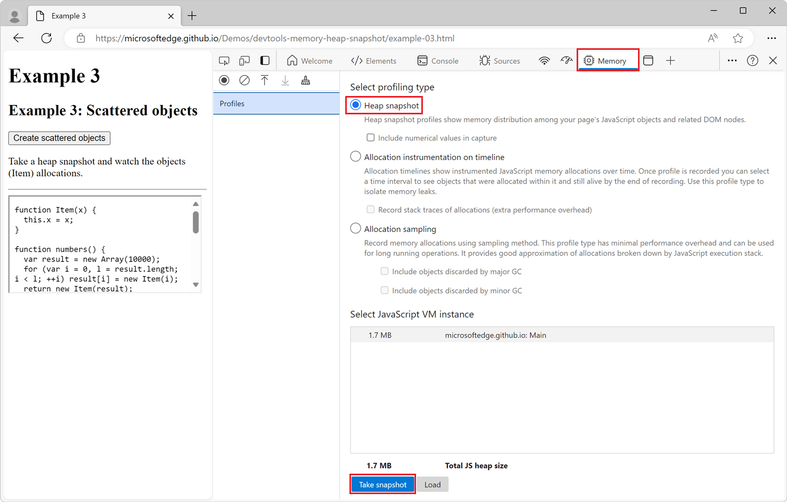

After the newly recorded heap snapshot has been loaded into DevTools and has been parsed, the snapshot is displayed and a new entry appears in the **Profiles** sidebar under **HEAP SNAPSHOTS**:

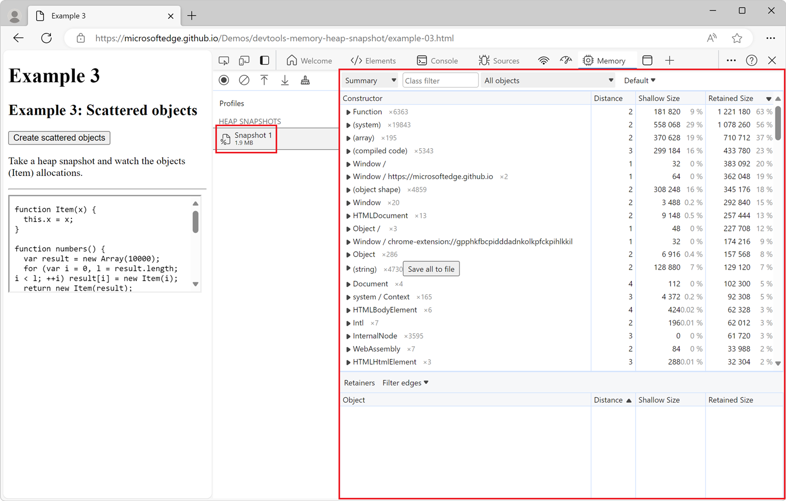

The number below the new sidebar item shows the total size of the reachable JavaScript objects. To learn more about object sizes in the heap snapshot, see [Object sizes and distances](./memory-101.md#object-sizes-and-distances) in _Memory terminology_.

The snapshot only displays the objects from the memory graph that are reachable from the global object. Taking a snapshot always starts with a garbage collection.


<!-- ------------------------------ -->
#### Take another snapshot

To take another snapshot when one is already displayed in the **Memory** tool, click **Profiles** above the existing snapshot in the sidebar:

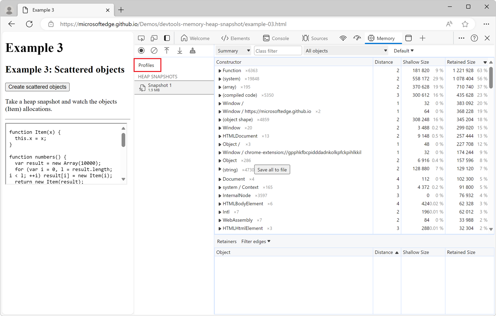


<!-- ====================================================================== -->
## Clear snapshots

To clear all snapshots from the **Memory** tool, click the **Clear all profiles** () icon:


<!-- ====================================================================== -->
## View snapshots

Heap snapshots can be viewed in multiple different ways in the **Memory** tool. Each way corresponds to a different task:

* The **Summary** view shows objects grouped by their constructor name.  Use it to find objects, and the memory they use, based on types grouped by constructor name. The **Summary** view is particularly helpful for **tracking down DOM leaks**.

<!--todo: add profile memory problems memory diagnosis (tracking down DOM leaks) section when available  -->

* The **Comparison** view displays the differences between two snapshots. Use it to compare two (or more) memory snapshots from before and after an operation.  Inspecting the delta in freed memory and reference count lets you confirm the presence and cause of a memory leak.

* The **Containment** view allows the exploration of the heap contents.  The **Containment** view provides a better view of object structure, helping analyze objects referenced in the global namespace (window) to find out what is keeping objects around.  Use it to analyze closures and dive into your objects at a low level.

To switch between views, use the dropdown list at the top of the **Memory** tool:

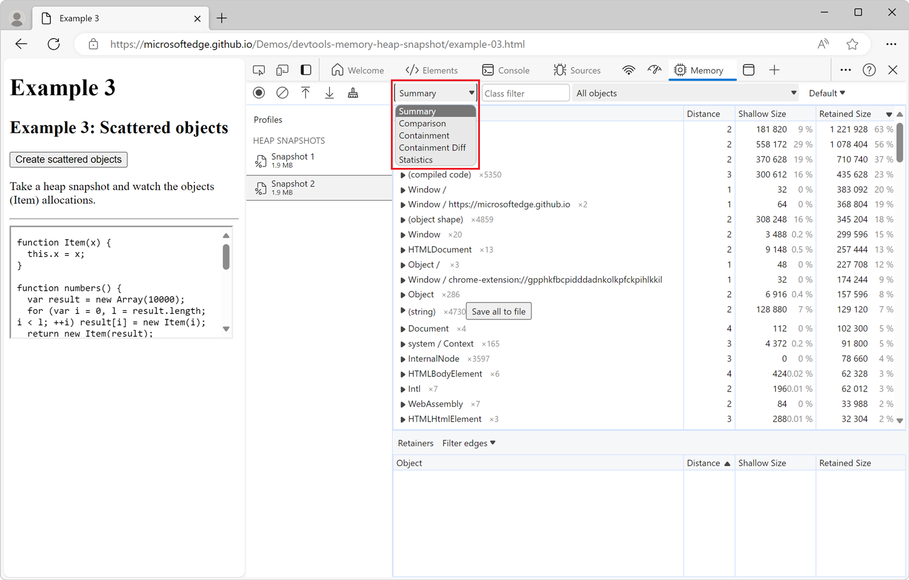

> [!NOTE]
> Not all properties are stored on the JavaScript heap.  Properties implemented using getters that run native code aren't captured.  Also, non-string values such as numbers aren't captured.

<!-- ------------------------------ -->
#### Summary view

Initially, a heap snapshot opens in the **Summary** view, which displays a list of constructors. Each constructor in the list can be expanded to show the objects that were instantiated using that constructor:

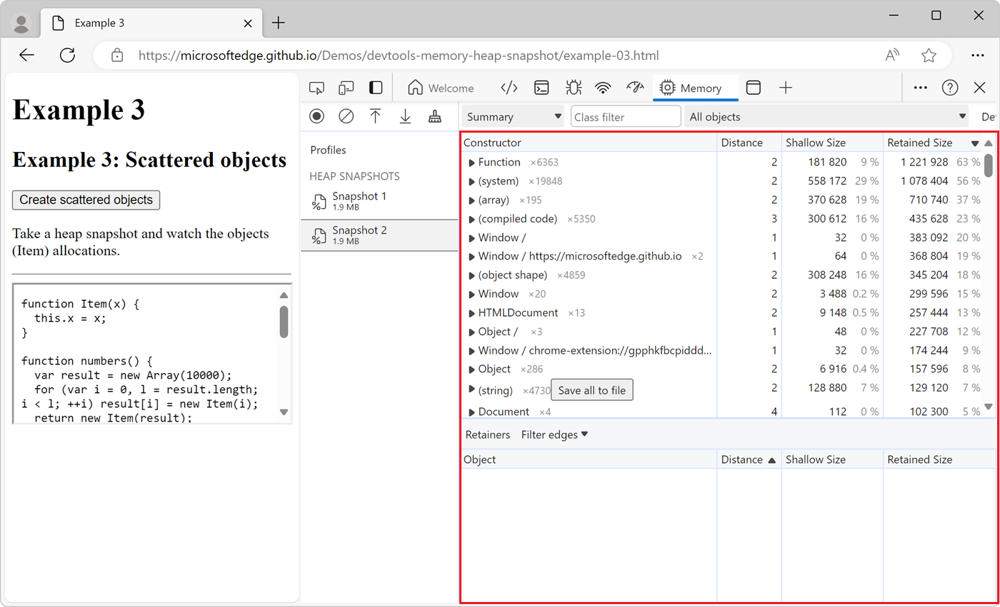

Top-level entries in the list of constructors are _total lines_.

| Top-level entries | Description |
|:--- |:--- |
| **Constructor** | Represents all objects created using this constructor. |
| **Distance** | Displays the distance to the root using the shortest simple path of nodes.  See [Distance](./memory-101.md#distance) in _Memory terminology_. |
| **Shallow size** | Displays the sum of shallow sizes of all objects created by a certain constructor function.  The shallow size is the size of memory held by an object (generally, arrays and strings have larger shallow sizes).  See [Shallow size](./memory-101.md#shallow-size) in _Memory terminology_. |
| **Retained size** | Displays the maximum retained size among the same set of objects.  The size of memory that you can free after an object is deleted (and the dependents are made no longer reachable) is called the retained size.  See [Retained size](./memory-101.md#retained-size) in _Memory terminology_. |

After expanding a total line in the **Summary** view, all of the instances are displayed.  For each instance, the shallow and retained sizes are displayed in the corresponding columns.  The number after the `@` character is the unique ID of the object, allowing you to compare heap snapshots on per-object basis.

* Yellow objects have JavaScript references.
* Red objects are detached nodes.  A detached node is referenced from a node that has a yellow background.

###### Constructor entries in the Summary view

The **Summary** view in the **Memory** tool lists object constructor groups:

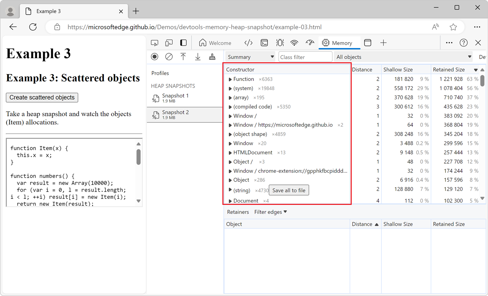

The constructor groups in the **Summary** view might be built-in functions such as `Array` or `Object` or they might be functions defined in your own code.

To reveal the list of objects that were instantiated by a given constructor, expand the constructor group.

###### Special category names in the Summary view

The **Summary** view also contains special category names that aren't based on constructors. These special categories are:

| Category name | Description |
|:--- |:--- |
| **(array)** | Various internal array-like objects which don't directly correspond to objects visible from JavaScript, such as the contents of JavaScript Arrays, or the named properties of JavaScript objects. |
| **(compiled code)** | Internal data that V8 (Microsoft Edge's JavaScript engine) needs to run functions defined by JavaScript or WebAssembly. V8 automatically manages memory usage in this category: if a function runs many times, V8 uses more memory for that function so that the function runs faster. If a function hasn't run in a while, V8 might delete the internal data for that function. |
| **(concatenated string)** | When two strings are concatenated together, such as when using the JavaScript `+` operator, V8 might choose to represent the result internally as a _concatenated string_. Rather than copying all of the characters of the two strings into a new string, V8 creates a small object which points to the two strings. |
| **InternalNode**  | Objects allocated outside of V8, such as C++ objects defined by Blink, Microsoft Edge's rendering engine. |
| **(object shape)** | Information about objects, such as the number of properties they have and a reference to their prototypes, which V8 maintains internally when objects are created and updated. This allows V8 to efficiently represent objects with the same properties. |
| **(sliced string)** | When creating a substring, such as when using the JavaScript `substring` method, V8 might choose to create a _sliced string_ object rather than copying all of the relevant characters from the original string. This new object contains a pointer to the original string and describes which range of characters from the original string to use. |
| **system / Context** | Local variables from a JavaScript scope which can be accessed by some nested function. Every function instance contains an internal pointer to the context in which it executes, so that it can access those variables. |
| **(system)** | Various internal objects that haven't yet been categorized in any more meaningful way. |


<!-- ------------------------------ -->
#### Comparison view

To find leaked objects, compare multiple snapshots to each other.  In a web application, usually, doing an action and then the reverse action shouldn't lead to more objects in memory. For example, when opening a document and then closing it, the number of objects in memory should be the same as before opening the document.

To verify that certain operations don't create leaks:

1. Take a heap snapshot before performing an operation.

1. Perform the operation.  That is, interact with the page in some way that might be causing a leak.

1. Perform the reverse operation.  That is, do the opposite interaction and repeat it a few times.

1. Take a second heap snapshot.

1. In the second heap snapshot, change the view to **Comparison**, comparing it to **Snapshot 1**.

In the **Comparison** view, the difference between two snapshots is displayed.  When expanding a total entry, added and deleted object instances are shown.

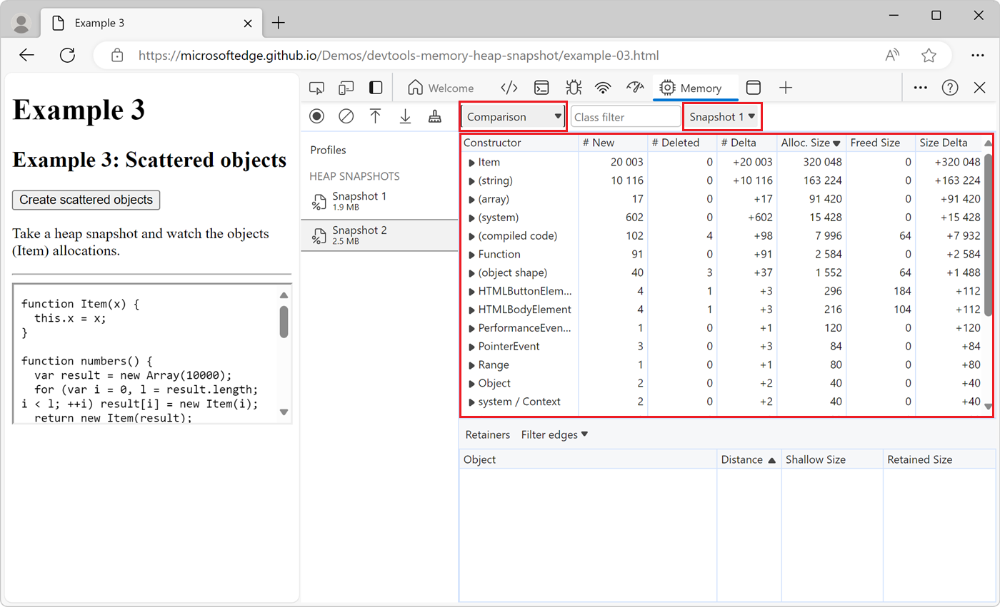

<!--todo: add HeapProfilingComparison section when available  -->

<!-- ------------------------------ -->
#### Containment view

The **Containment** view is essentially a "bird's eye view" of the objects structure of your application.  It allows you to peek inside function closures, to observe virtual machine (VM) internal objects that together make up your JavaScript objects, and to understand how much memory your application uses at a very low level. <!-- Low level makes little sense since we just said it provided a bird's eye view. -->

| Containment view entry points | Description |
|:--- |:--- |
| **DOMWindow objects** | Global objects for JavaScript code.  |
| **GC roots** | The actual GC roots used by the garbage of the VM.  GC roots are comprised of built-in object maps, symbol tables, VM thread stacks, compilation caches, handle scopes, and global handles.  |
| **Native objects** | Browser objects "pushed" inside the JavaScript virtual machine (JavaScript VM) to allow automation, for example, DOM nodes, CSS rules.  |


<!--todo: add heap profiling containment section when available  -->


<!-- ------------------------------ -->
#### The retainers section

The **Retainers** section is displayed at the bottom of the **Memory** tool and shows all the objects which point to the selected object. The **Retainers** section is updated when you select a different object in the **Summary**, **Containment**, or **Comparison** view.

In the following screenshot, a string object was selected in the **Summary** view, and the **Retainers** section shows that the string is retained by the `x` property of the `Item` class, found in the `example-03.js` file:

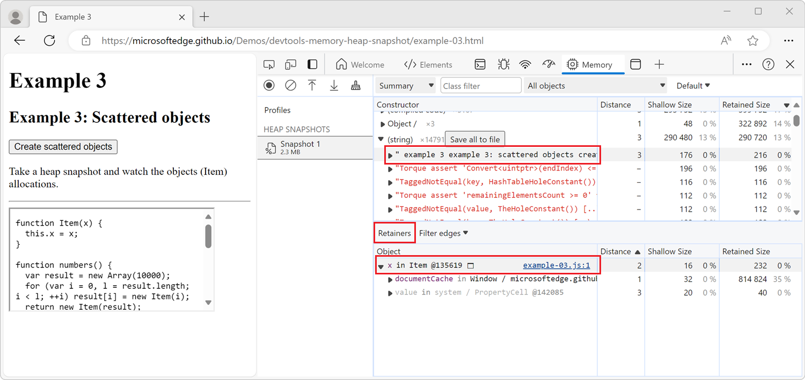

###### Hide cycles

In the **Retainers** section, when you analyze the objects which retain the selected object, you might encounter _cycles_. Cycles occur when the same object appears more than once in the retainer path of the selected object. In the **Retainers** section, a cycled object is indicated by being grayed out.

To help simplify the retainer path, hide cycles in the **Retainers** section by clicking the **Filter edges** dropdown menu and then selecting **Hide cycled**:


###### Hide internal nodes

_Internal nodes_ are objects that are specific to V8 (the JavaScript engine in Microsoft Edge).

To hide internal nodes from the **Retainers** section, in the **Filter edges** dropdown menu, select **Hide internal**.


<!-- ====================================================================== -->
## Filter heap snapshots by node types

Use filters to focus on specific parts of a heap snapshot.

When looking at all the objects in a heap snapshot in the **Memory** tool, it can be difficult to focus on specific objects or retaining paths.  Use the **Node Types** filter when looking at a heap snapshot, to focus on only specific types of nodes.  For example, to see only the arrays and string objects that are in the heap, select the **Array** and **String** entries in the **Node Types** filter.


<!-- ====================================================================== -->
## Find a specific object

To find an object in the collected heap, you can search using **Ctrl+F** and give the object ID.


<!-- ====================================================================== -->
## Uncover DOM leaks

The heap profiler has the ability to reflect bidirectional dependencies between browser native objects (DOM nodes, CSS rules) and JavaScript objects.  This helps to discover otherwise invisible leaks that happen because of forgotten detached DOM subtrees that remain in memory.

Consider the following code sample.  When is the element with ID `tree` garbage-collected?

```javascript
// Getting a reference to the #tree element.
var treeRef = document.querySelector("#tree");

// Getting a reference to the #leaf element,
// which is a descendant of the #tree element.
var leafRef = document.querySelector("#leaf");

// Removing the #tree element from the DOM.
document.body.removeChild(treeRef);

// The #tree element can't be garbage-collected yet
// because the treeRef variable still exists.

// Removing the treeRef variable.
treeRef = null;

// The #tree element is still not garbage-collected
// because of the indirect reference from the leafRef variable.

// Removing the leafRef variable.
leafRef = null;

// Now the #tree element can be garbage-collected.
```

The element with ID `leaf` maintains a reference to its ancestor nodes in the DOM, which includes the element with ID `tree`. Both `treeRef` and `leafRef` must be nullified for the whole DOM tree under the element with ID `tree` to be garbage-collected.

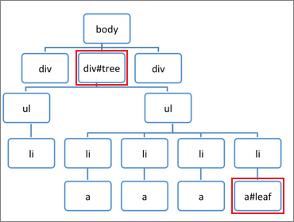

<!-- ------------------------------ -->
#### Demo webpage: Example 6: Leaking DOM nodes

Open the example webpage [Example 6: Leaking DOM nodes](https://microsoftedge.github.io/Demos/devtools-memory-heap-snapshot/example-06.html) in a new window or tab, to understand where DOM nodes might leak, and how to detect such leakage.

<!-- You can view the source files for the Heap Snapshots demo pages at the [MicrosoftEdge/Demos > devtools-memory-heap-snapshot](https://github.com/MicrosoftEdge/Demos/tree/main/devtools-memory-heap-snapshot) repo folder. -->

<!-- ------------------------------ -->
#### Demo webpage: Example 9: DOM leaks bigger than expected

Open the example webpage [Example 9: DOM leaks bigger than expected](https://microsoftedge.github.io/Demos/devtools-memory-heap-snapshot/example-09.html) in a new window or tab.

<!-- You can view the source files for the Heap Snapshots demo pages at the [MicrosoftEdge/Demos > devtools-memory-heap-snapshot](https://github.com/MicrosoftEdge/Demos/tree/main/devtools-memory-heap-snapshot) repo folder. -->

<!-- Example: Try this **demo** to play with detached DOM trees. -->

<!-- todo: add heap profiling dom leaks section when available -->


<!-- ====================================================================== -->
<!--[heap profiling comparison](https://developer.alphabet.com/devtools/docs/heap-profiling-comparison) -->
<!--[heap profiling containment](https://developer.alphabet.com/devtools/docs/heap-profiling-containment) -->
<!--[heap profiling DOM leaks](https://developer.alphabet.com/devtools/docs/heap-profiling-dom-leaks) -->
<!--[heap profiling summary](https://developer.alphabet.com/devtools/docs/heap-profiling-summary) -->
<!--[narrow down causes of memory leaks](../profile/memory-problems/memory-diagnosis#narrow-down-causes-of-memory-leaks) -->


<!-- ====================================================================== -->
## Analyze the impact of closures on memory

To analyze the impact of closures on memory, try out this example:

1. Open the [Eval is evil](https://microsoftedge.github.io/Demos/devtools-memory-heap-snapshot/example-07.html) demo webpage in a new window or tab.

1. Record a first heap snapshot.

1. In the rendered webpage, click the **Closures with eval** button.

1. Record a second heap snapshot.

   In the sidebar, the number below the second snapshot should be larger than the number below the first snapshot. This indicates that more memory is being used by the webpage after clicking the **Closures with eval** button.

1. In the second heap snapshot, change the view to **Comparison**, comparing it to the first one.

   The **Comparison** view shows that new strings were created in the second heap snapshot:

   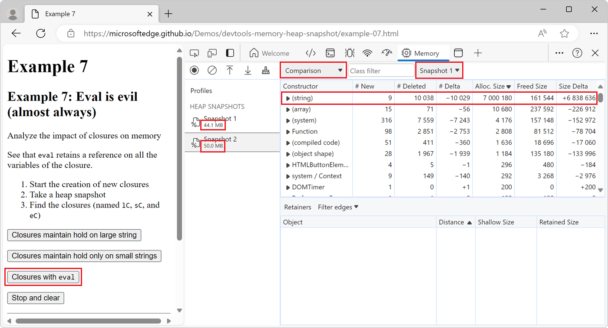

1. In the **Comparison** view, expand the **(string)** constructor.

1. Click the first **(string)** entry.

   The **Retainers** section is updated and shows that the `largeStr` variable retains the string selected in the **Comparison** view.

   The `largeStr` entry is automatically expanded and shows that the variable is retained by the `eC` function, which is the closure where the variable is defined:

   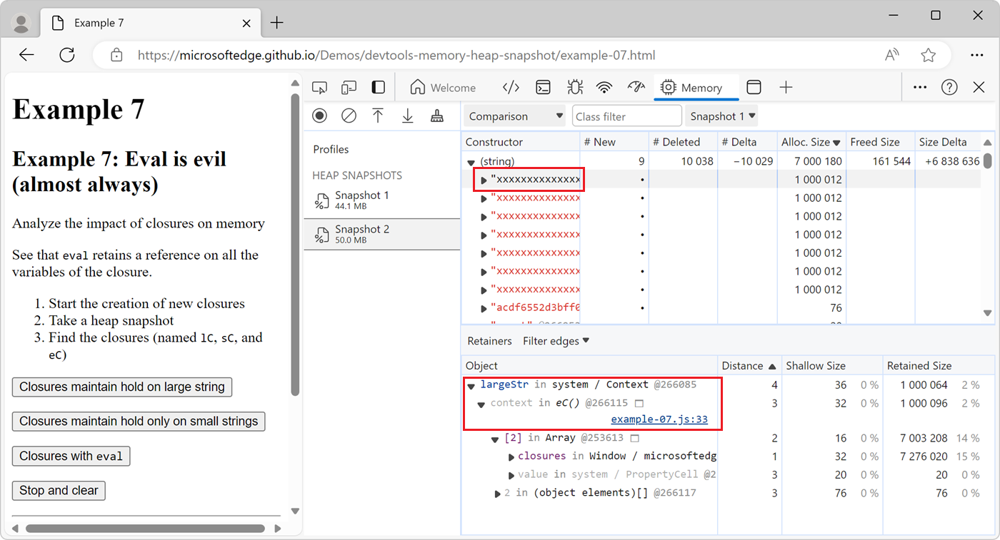


<!-- ------------------------------ -->
#### Tip: name functions to differentiate between closures in a snapshot

To easily distinguish between JavaScript closures in a heap snapshot, give your functions names.

The following example uses an unnamed function to return the `largeStr` variable:

```javascript
function createLargeClosure() {
    const largeStr = 'x'.repeat(1000000).toLowerCase();

    // This function is unnamed.
    const lC = function() {
        return largeStr;
    };

    return lC;
}
```

The following example names the function, which makes it easier to distinguish between closures in the recorder heap snapshot:

```javascript
function createLargeClosure() {
    const largeStr = 'x'.repeat(1000000).toLowerCase();

    // This function is named.
    const lC = function lC() {
        return largeStr;
    };

    return lC;
}
```


<!-- ====================================================================== -->
## Save and export strings from a heap snapshot to JSON

When taking a heap snapshot in the **Memory** tool, you can export all string objects from the snapshot to a JSON file.  In the **Memory** tool, in the **Constructor** section, click the **Save all to file** button next to the `(string)` entry:

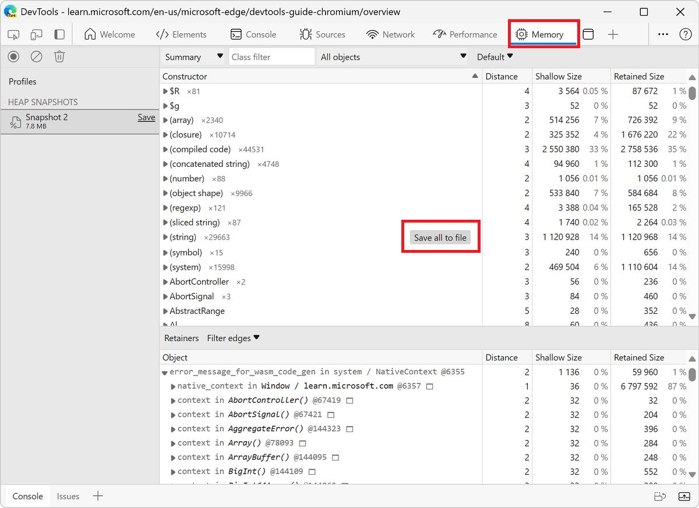

The **Memory** tool exports a JSON file that contains all of the string objects from the heap snapshot:


<!-- ====================================================================== -->
## See also

* [Memory terminology](./memory-101.md).
* [Finding and debugging memory leaks in JavaScript with Chrome DevTools](https://slid.es/gruizdevilla/memory) by Gonzalo Ruiz de Villa, which also applies to Microsoft Edge DevTools.


<!-- ====================================================================== -->
> [!NOTE]
> Portions of this page are modifications based on work created and [shared by Google](https://developers.google.com/terms/site-policies) and used according to terms described in the [Creative Commons Attribution 4.0 International License](https://creativecommons.org/licenses/by/4.0).
> The original page is found [here](https://developer.chrome.com/docs/devtools/memory-problems/heap-snapshots/) and is authored by [Meggin Kearney](https://developers.google.com/web/resources/contributors#meggin-kearney) (Technical Writer).

[](https://creativecommons.org/licenses/by/4.0)
This work is licensed under a [Creative Commons Attribution 4.0 International License](https://creativecommons.org/licenses/by/4.0).
