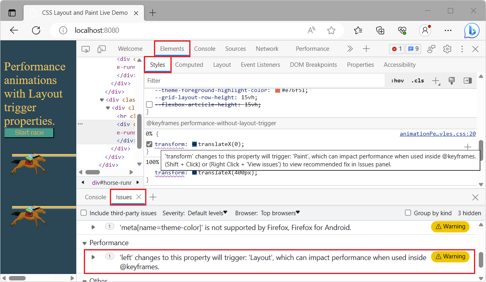
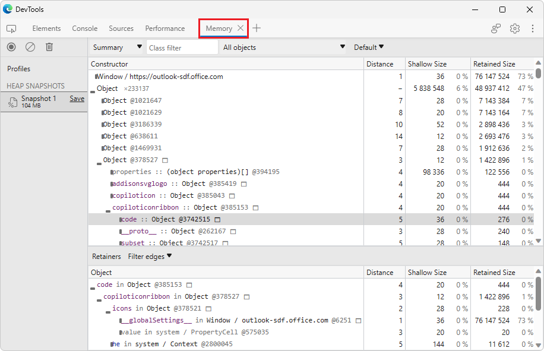
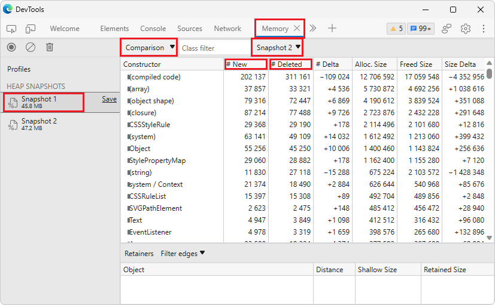
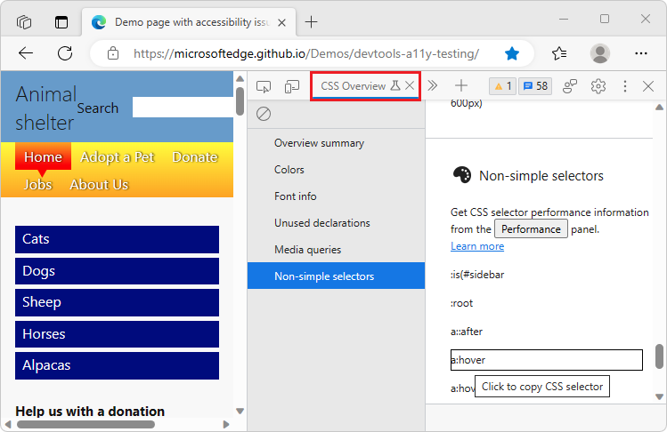

# What's New in DevTools (Microsoft Edge 114)

[!INCLUDE [Microsoft Edge team note for top of What's New](../../includes/edge-whats-new-note.md)]

> [!TIP]
> The **Microsoft Build 2023** conference was on May 23-25, 2023.  Learn more about new features for memory, performance, and production debugging in DevTools, as well as new capabilities for PWAs in the sidebar, WebView2, and Chat Plugins, in the following videos:
> * [Microsoft Edge | State of web developer tools](https://www.youtube.com/watch?v=yDFmQNu3TSg&list=PL4z1-7pjJU6zJT3PBQ4mTbNg2wtX7Lt52)
> * [Microsoft Edge | Building Progressive Web Apps for the sidebar](https://www.youtube.com/watch?v=9u8lRzRUayw&list=PL4z1-7pjJU6zJT3PBQ4mTbNg2wtX7Lt52)
> * [Microsoft Edge | Bringing WebView2 to Microsoft Teams and beyond](https://www.youtube.com/watch?v=s3tDUvaoCP4&list=PL4z1-7pjJU6zJT3PBQ4mTbNg2wtX7Lt52)
> * [Building Chat Plugins for Microsoft Bing and Edge](https://www.youtube.com/watch?v=Q-5M7EYjl6U&list=PL4z1-7pjJU6zJT3PBQ4mTbNg2wtX7Lt52)

<!-- ====================================================================== -->
## Aggregate Selector Stats in the Performance tool

<!-- Subtitle: Instead of selecting individual Recalculate Style events when recording a profile, the Selector Stats tab now aggregates data across all Recalculate Style events-->

<!-- Reviewer: Gavin Xu -->

In [Microsoft Edge 109](../01/devtools-109.md#debug-long-running-recalculate-style-events-with-new-selector-stats), we added the **Selector Stats** feature to the **Performance** tool.  You can use the data from **Selector Stats** to understand which CSS selectors are taking the most time during **Recalculate Style** events in the **Performance** tool and contributing to slow performance.

Now in Microsoft Edge 114, you no longer need to select an individual **Recalculate Style** event to see the selectors that were recalculated during that event.  Rather, the **Selector Stats** tab in the bottom pane of the **Performance** tool automatically aggregates the data across all of the **Recalculate Style** events in the recorded profile.  As you zoom into specific parts of the profile, the **Selector Stats** tab updates to only show data from the portion of the profile that you are currently analyzing.

Also, a new column called **Style sheet** has been added to the **Selector Stats** tab and contains links for each selector back to the stylesheet where the selectors are defined:

<!-- todo
1. Open Devtools and navigate to the Performance tool.
2. Click the capture settings button.
3. Check the box at the top that says "Enable advanced rendering instrumentation (slow)".
4. Click a purple "Recalculate style" box.
5. Click the Selector stats button on the bar below.
-->

Thank you for using the **Selector Stats** feature and sharing your feedback with us in [GitHub Issue #98: \[Feedback\] Selector Performance Tracing Explainer](https://github.com/MicrosoftEdge/DevTools/issues/98)!

See also:
* [Analyze selector performance during Recalculate Style events](../../../evaluate-performance/selector-stats.md)
* [GitHub Issue #98: \[Feedback\] Selector Performance Tracing Explainer](https://github.com/MicrosoftEdge/DevTools/issues/98)

<!-- ====================================================================== -->
## The Issues tool warns you when CSS properties trigger reflow
<!-- todo: is this a change to the Issues tool, Styles pane, or both? -->

<!-- Subtitle: The Styles pane shows a wavy underline on CSS properties that trigger reflow, to help you limit reflow and avoid blocking user interaction.  Reflow is when the browser re-calculates the positions and geometries of elements in the page. -->

<!-- Reviewer: Vidal Guillermo Diazleal Ortega -->

Reflow is the web browser process for recalculating the positions and geometries of elements in the document, to re-render part or all of the document.  Because reflow is a user-blocking operation in the browser, for performance, we recommend limiting reflow as much as possible, to keep your web content smooth and responsive to interaction.

Some CSS properties don't trigger reflow, because they run on the compositor thread in the browser - for example, the [transform](https://developer.mozilla.org/docs/Web/CSS/transform) and [opacity](https://developer.mozilla.org/docs/Web/CSS/opacity) properties.

Now, the **Styles** pane in the **Elements** tool adds a wavy underline on CSS properties that trigger reflow.  To view the issue in a tooltip, hover over the wavy underline:

<!-- done:
1. Go to https://www.w3schools.com/css/css3_animations.asp
1. Select the animated div in the Elements tool.  To do this, in DOM tree, Find animated_div (2nd hit).
1. Scroll down in the Styles pane until you see the animation CSS: 0%, in the @keyframes animated_div section.
1. Hover over the yellow/green wavy underline of "left" to see the issue tooltip.
1. Right click and select "View issues" to open the Issues tool.
1. Ensure that in the Issues tool, Tips are also being displayed.
-->

To open the issue in the **Issues** tool, **Shift**+click the wavy underline, or right-click the wavy underline and then select **View issues**.  The **Issues** tool opens in the Drawer at the bottom of DevTools:

See also:
* [Minimizing browser reflow | PageSpeed Insights](https://developers.google.com/speed/docs/insights/browser-reflow)
* [Open issues from the DOM tree](../../../issues/index.md#open-issues-from-the-dom-tree) from *Find and fix problems using the Issues tool*

<!-- ====================================================================== -->
## You can load Enhanced Traces larger than 1 GB in DevTools

<!-- Subtitle: In previous versions of Microsoft Edge, loading enhanced traces larger than 1 GB would produce an error. In Microsoft Edge 114, this issue has been fixed. -->

<!-- Reviewer: Rob Paveza -->

Enhanced traces are an experimental feature in Microsoft Edge that allow you to export and import entire DevTools instances, saved as `.devtools` files, with as much state preserved as possible across the **Memory**, **Performance**, **Elements**, **Console**, and **Sources** tools.  These files open in a separate DevTools instance and load DOM snapshots, Console messages, heap snapshots, and performance profiles, retaining references to source code.

In previous versions of Microsoft Edge, loading an enhanced trace larger than 1 GB failed.  In Microsoft Edge 114, this issue has been fixed.  You can now successfully load enhanced traces of any size.

<!-- todo
1. Import the .devtools file I sent you when we were working on the last What's New in the Memory tool.
1. Expand some object until you get a more full retaining path in the bottom pane.
1. Take a screenshot.
-->

See also:
* [Share enhanced performance and memory traces](../../../experimental-features/share-traces.md)
* [GitHub Issue #122: \[Feedback\] Enhanced Traces experiment](https://github.com/MicrosoftEdge/DevTools/issues/122)

<!-- ====================================================================== -->
## The Memory tool more accurately compares two heap snapshots

<!-- Subtitle: In previous versions of Microsoft Edge, the Memory tool incorrectly reported lots of new and deleted objects when comparing two heap snapshots. This issue has now been fixed.-->

<!-- Reviewer: Seth Brenith -->

In the **Memory** tool, you can take multiple heap snapshots and compare them to find differences in the objects in the heap.  In previous versions of Microsoft Edge, the **Memory** tool incorrectly reported large numbers of new and deleted objects when comparing heap snapshots because object IDs were not being tracked consistently by the tool.

For example, notice how in the above screenshot, the comparison view is reporting `1966` new `(concatenated string)` objects and `1989` deleted `(concatenated string)` objects when really, many of these are likely the same objects.  In Microsoft Edge 114, this issue has now been fixed by ensuring consistent object IDs are tracked across multiple snapshots.

<!-- todo
1. Go to https://www.youtube.com
1. Open DevTools > Memory tool.
1. Take a heap snapshot.
1. Refresh the page.
1. Take another heap snapshot.
1. Select the Summary dropdown and select comparison and now compare the two heap snapshots you took.
-->

See also:
* [View snapshots](../../../memory-problems/heap-snapshots.md#view-snapshots) from _Record heap snapshots using the Memory tool_
* [Change List 4278992: Produce consistent IDs for Oilpan objects in heap snapshots](https://chromium-review.googlesource.com/c/v8/v8/+/4278992)
* [Issue 1286500: Heap snapshot comparison incorrectly reports large numbers of new and deleted objects](https://bugs.chromium.org/p/chromium/issues/detail?id=1286500)

<!-- ====================================================================== -->
## Accessibility improvements for the CSS Overview tool

<!-- Subtitle: The CSS Overview tool is now easier to use with assistive technology, like screen readers. -->

<!-- Reviewer: Yanling Wang -->

In [Microsoft Edge 112](../04/devtools-112.md#css-overview-tool-displays-non-simple-selectors-for-quick-performance-gains), the **CSS Overview** tool was updated to display a list of non-simple selectors when taking an overview snapshot of your webpage's CSS.  In Microsoft Edge 114, this section of the **CSS Overview** tool is now easier to use with assistive technology, like screen readers.

When you navigate to a selector in the **Non-simple selectors** section of the **CSS Overview** tool and press `Enter` or click, screen readers will now announce "Copied CSS Selector."

<!-- todo
1. Open the Edge Canary browser.
2. Open Devtools using 'Ctrl+Shift+ I' or (Settings and more -> More tools -> Developer tools).
3. Navigate to 'CSS selector overview' tab item and invoke it.
4. Navigate to ‘capture overview’ button and invoke it.
5. Navigate and invoke the ‘Non-simple selectors’ menu item in the left navigation.
6. Navigate to the list items present under ‘Non-simple selectors’ heading and hit enter and listen to the Screen reader announcement.
-->

See also:
* [CSS Overview tool displays non-simple selectors for quick performance gains](../04/devtools-112.md#css-overview-tool-displays-non-simple-selectors-for-quick-performance-gains) from _What's New in DevTools (Microsoft Edge 112)_
* [Non-simple selectors](../../../css/css-overview-tool.md#non-simple-selectors) from _Optimize CSS styles with the CSS Overview tool_

<!-- ====================================================================== -->
## Debugging Microsoft Edge in VS Code has better support for high contrast mode

<!-- Subtitle: Hovering over icons in high contrast mode in the VS Code extension now renders with sufficient contrast.-->

<!-- Reviewer: Vidal Guillermo Diazleal Ortega -->

In previous versions of the Microsoft Edge DevTools extension for Visual Studio Code, in high contrast mode, hovering over icons within the tools did not render with sufficient contrast.  In the latest version of the Microsoft Edge DevTools extension, this issue has been fixed.

In the **Styles** pane in the **Elements** tool, checkboxes for applying styles to elements now render correctly in high contrast mode:

In the **Console** tool, icons such as **Show console sidebar** now render correctly in high contrast mode:

<!-- todo
Prerequisites:
 1. Install 'Visual Studio Code' application.
 2. Add 'Microsoft edge' file in vs code.
 3. Turn on Windows High contrast theme (Settings->Accessibility->High Contrast->Turn on High 4. Contrast->Select High Contrast Aquatic)

Steps:
1. Launch VS code application and launch an instance.
2. Navigate and invoke 'Elements' tab item and invoke it.
3. Navigate to 'Styles' tab item and invoke it.
4. Hover over the checkboxes for individual style rules
1. Switch to the Console and hover over the Show console sidebar icon
-->

See also:
* [Microsoft Edge DevTools extension for Visual Studio Code](../../../../visual-studio-code/microsoft-edge-devtools-extension.md)
* [Turn high contrast mode on or off in Windows](https://support.microsoft.com/windows/turn-high-contrast-mode-on-or-off-in-windows-909e9d89-a0f9-a3a9-b993-7a6dcee85025)

<!-- ====================================================================== -->
## Announcements from the Chromium project

Microsoft Edge 114 also includes the following updates from the Chromium project:

* [WebAssembly debugging support](https://developer.chrome.com/blog/new-in-devtools-114/#wasm)
   * [Improved stepping behavior in Wasm apps](https://developer.chrome.com/blog/new-in-devtools-114/#wasm-step)
* [Debug Autofill using the Elements panel and Issues tab](https://developer.chrome.com/blog/new-in-devtools-114/#autofill)
* [Lighthouse 10.1.1](https://developer.chrome.com/blog/new-in-devtools-114/#lighthouse)
* [Performance enhancements](https://developer.chrome.com/blog/new-in-devtools-114/#performance)
   * [performance.mark() shows timing on hover in Performance > Timings](https://developer.chrome.com/blog/new-in-devtools-114/#mark)
   * [profile() command populates Performance > Main](https://developer.chrome.com/blog/new-in-devtools-114/#profile)
   * [Warning for slow user interactions](https://developer.chrome.com/blog/new-in-devtools-114/#slow-interaction-warning)
* [JavaScript Profiler deprecation: Phase three](https://developer.chrome.com/blog/new-in-devtools-114/#js-profiler)
* [Miscellaneous highlights](https://developer.chrome.com/blog/new-in-devtools-114/#misc)

<!-- ====================================================================== -->
<!-- uncomment if content is copied from developer.chrome.com to this page -->

<!-- > [!NOTE]
> Portions of this page are modifications based on work created and [shared by Google](https://developers.google.com/terms/site-policies) and used according to terms described in the [Creative Commons Attribution 4.0 International License](https://creativecommons.org/licenses/by/4.0).
> The original page for announcements from the Chromium project is [What's New in DevTools (Chrome 114)](https://developer.chrome.com/blog/new-in-devtools-114) and is authored by [Jecelyn Yeen](https://developers.google.com/web/resources/contributors#jecelynyeen) (Developer advocate working on Chrome DevTools at Google). -->

<!-- ====================================================================== -->
<!-- uncomment if content is copied from developer.chrome.com to this page -->

<!-- 
This work is licensed under a [Creative Commons Attribution 4.0 International License](https://creativecommons.org/licenses/by/4.0). -->
