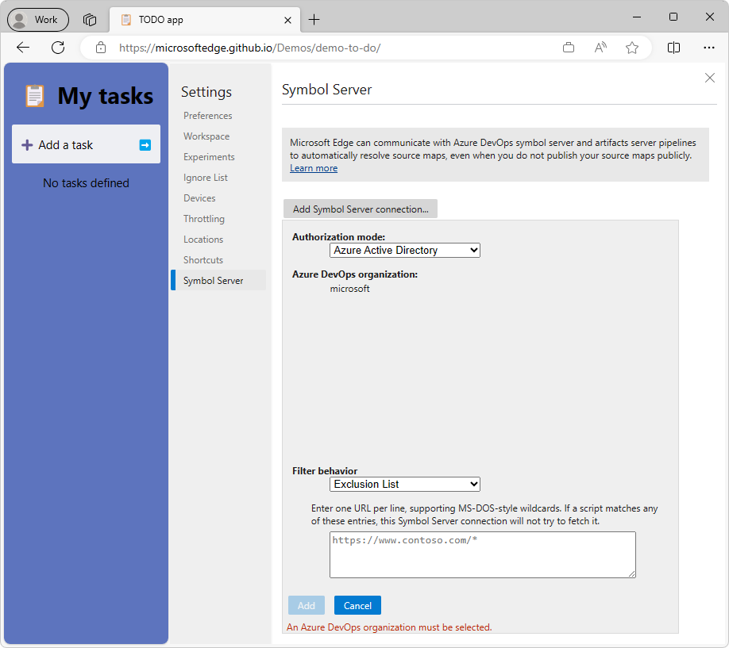
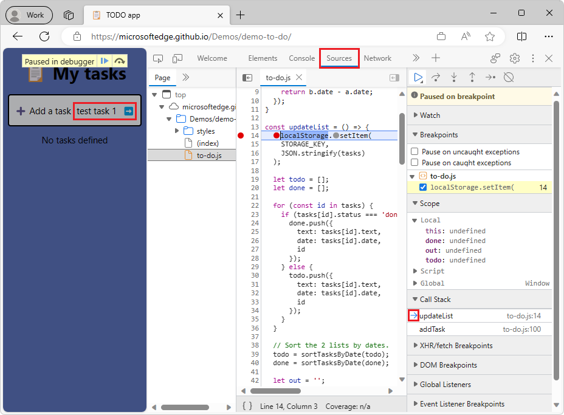
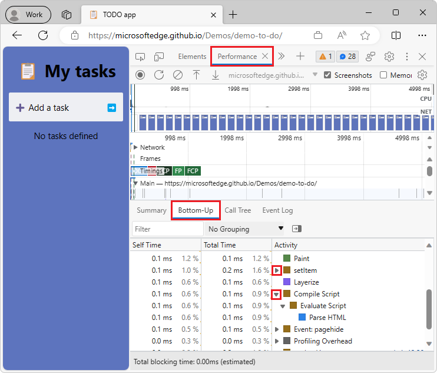
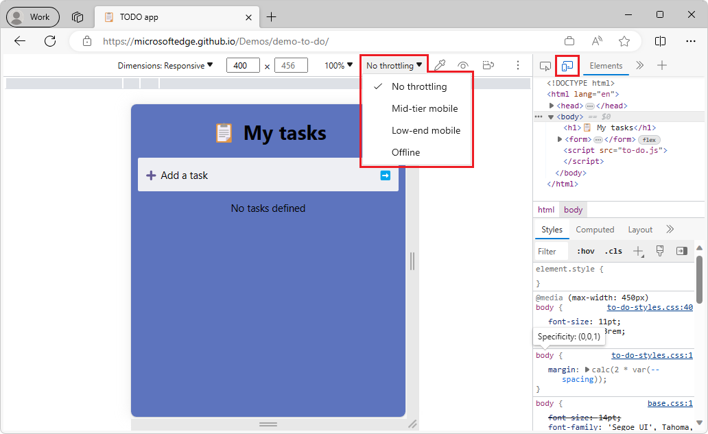
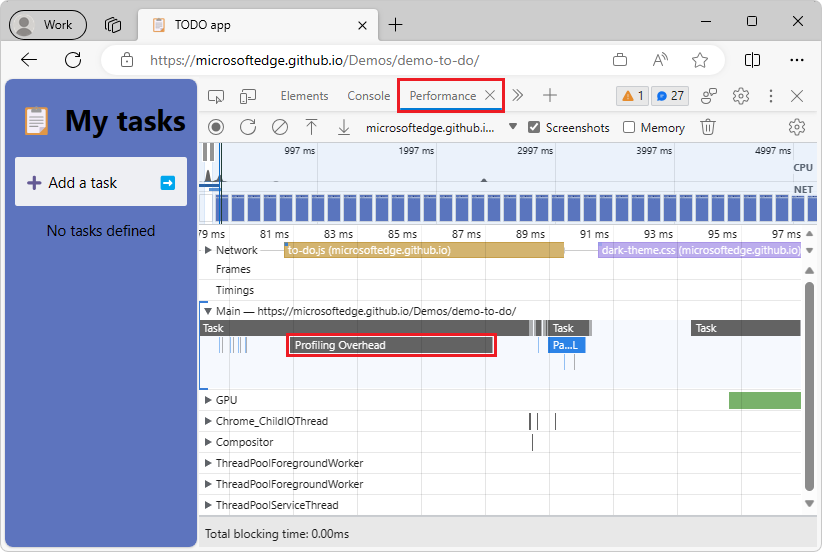

# What's New in DevTools (Microsoft Edge 115)

[!INCLUDE [Microsoft Edge team note for top of What's New](../../includes/edge-whats-new-note.md)]

<!-- ====================================================================== -->
## Improvements for connecting DevTools to Azure Artifacts symbol server

<!-- Subtitle: You can now use Azure Active Directory for authentication instead of Personal Access Tokens (PATs). You can connect to multiple symbol servers and filter which sourcemaps you want DevTools to fetch. -->

<!-- Reviewer: Rob Paveza-->

In Microsoft Edge 115, we've made it easier and more customizable to connect DevTools to Azure Artifacts symbol server.  In previous versions of Microsoft Edge, you had to generate Personal Access Tokens (PATs) in Azure DevOps and paste them into DevTools in order to authenticate to symbol server. Now, as long as you are logged into Microsoft Edge, you can connect to symbol server with Azure Active Directory.

Additonally, you can now connect to multiple symbol servers if you need to fetch sourcemaps from different Azure DevOps organizations. Finally, you can filter which sourcemaps you want DevTools to fetch from symbol server by specifying the sourcemap URLs in an inclusion or exclusion list.

<!-- todo: steps to re-create screenshot -->
<!--
1. Launch Edge, ensure that you are logged in to the browser
1. Open DevTools > Settings > Symbol Server
1. Under **Authorizaiton mode:**, select the dropdown and select Azure Active Directory
1. Load the Azure DevOps organizations
1. Take a screenshot
1. Draw red highlight boxes around Authorization mode and Filter behavior
1. See https://dev.azure.com/microsoft/Edge/_git/chromium.devtools-frontend/pullrequest/8874508 for more info
 -->
See also:
* [Securely debug original code by publishing source maps to the Azure Artifacts symbol server](../../../javascript/publish-source-maps-to-azure.md)
* [Securely debug original code by using Azure Artifacts symbol server source maps](../../../javascript/consume-source-maps-from-azure.md)

## Snapshotting improvements for the Memory tool

<!-- Subtitle: The "Allocation instrumentation on timeline" profiling type in the Memory tool now samples the heap at variable intervals, depending on the size of the heap. Heap snapshots are now more accurate and don't show objects that have been garbage-collected. -->

<!-- Reviewer: Seth Brenith and Sulekha Kulkarni -->

In previous versions of Microsoft Edge, in the **Memory** tool, when using the "Allocation instrumentation on timeline" option, the **Memory** tool takes a sample of the heap every 50 milliseconds.  However, taking a sample of the heap scales with the size of the heap so with a heap size of 200 MB, the sample actually takes 1.5 seconds to generate.  As a result, there is very little time left on the main thread for your website, outside of taking and generating snapshots.  In practice, this looks like your web content is hanging or blocked when "Allocation instrumentation on timeline" is running.

In Microsoft Edge 115, the sample rate for the heap now scales to the time it takes to generate a sample, freeing up the main thread so that you can interact with your web content while profiling.

<!-- todo: steps to re-create screenshot -->
<!--
1. Navigate to https://microsoftedge.github.io/Demos/demo-to-do/
1. Open DevTools > Memory.
1. Select the "Allocation instrumentation on timeline" profiling type
1. Take a screenshot
1. Draw a red highlight box around the "Allocation instrumentation on timeline" option
 -->

Additionally, in previous versions of Microsoft Edge, heap snapshots would sometimes include objects that have been garbage-collected (GC'd).  In Microsoft Edge 115, this issue has been fixed and heap snapshots are now more accurate.

See also:
* [Limit proportion of CPU time given to requestHeapStatsUpdate (4469909) · Gerrit Code Review](https://chromium-review.googlesource.com/c/v8/v8/+/4469909)
* [Make heap snapshots more precise (4499405) · Gerrit Code Review](https://chromium-review.googlesource.com/c/v8/v8/+/4499405)

<!-- ====================================================================== -->

<!-- ====================================================================== -->
## Refreshing the DevTools icons and buttons

<!-- Subtitle: In Microsoft Edge 115, new icons and buttons give an update to the DevTools look and feel. -->

<!-- Reviewer: Jimmy Seto and Vidal Guillermo Diazleal Ortega -->

In Microsoft Edge 115, the DevTools UI has gotten a small makeover with new icons and buttons.  For example, when debugging in the Sources tool, the current frame in the call stack is indicated with a right-facing blue arrow.  This icon is more consistent with debugging icons in Visual Studio and Visual Studio Code.

<!-- todo: steps to re-create screenshot -->
<!--
1. Navigate to https://microsoftedge.github.io/Demos/demo-to-do/
1. Open DevTools > Sources. Open the to-do.js file
1. Set a breakpoint on line 14
1. Add an item to the to-do list. The breakpoint should trigger
1. Ensure that the Call Stack section of the Sources tool is visible
1. Take a screenshot
1. Draw a red highlight box around the right-facing blue arrow icon
1. See: https://dev.azure.com/microsoft/Edge/_git/chromium.devtools-frontend/pullrequest/8927764 for more info
 -->

In previous versions of Microsoft Edge, in the **Bottom-Up** view in the **Performance** tool, the triangle buttons for collapsing and expanding the recorded activities were not rendering correctly.  In Microsoft Edge 115, this issue has been fixed and you can now expand and collapse individual activities to see what functions are calling them.

<!-- todo: steps to re-create screenshot -->
<!--
1. Navigate to https://microsoftedge.github.io/Demos/demo-to-do/
1. Open DevTools > Performance. Select the Reload icon to start profiling and reload the page
1. Wait and profiling will end on its own
1. Make sure the bottom pane is visible in the Performance tool. Switch to the Bottom-Up view.
1. Take a screenshot
1. Draw red highlight boxes around the triangle icons in the Bottom-Up view for expanding/collapsing activities
1. See: https://dev.azure.com/microsoft/Edge/_git/chromium.devtools-frontend/pullrequest/8952566 for more info
 -->

See also:
* [Step through code](../../../javascript/reference.md#step-through-code) from _JavaScript debugging features_
* [The Bottom-Up tab](../../../evaluate-performance/reference.md#the-bottom-up-tab) from _Performance features reference_

<!-- ====================================================================== -->
## Screen readers now correctly announce dropdown state in Device Mode

<!-- Subtitle: In previous versions of Microsoft Edge, in Device Mode, screen readers would incorrectly announce that dropdowns were expanded when they were collapsed. This issue has now been fixed. -->

<!-- Reviewer: Natasha Lee -->

In previous versions of Microsoft Edge, in Device Mode, screen readers would incorrectly announce the state of dropdown menus as "Expanded" when these menus were actually collapsed.  In Microsoft Edge 115, this issue has been fixed and screen readers now correctly announce dropdown state (for example, collapsed when the menu is collapsed) in Device Mode.

<!-- todo: steps to re-create screenshot -->
<!--
1. Navigate to https://microsoftedge.github.io/Demos/demo-to-do/
1. Open DevTools. Turn on Device Mode with the Toggle device emulation button in the top-left corner
1. Expand the viewport so that you can see all the buttons in the Device Mode toolbar
1. Select the **No throttling** dropdown menu
1. Take a screenshot with the menu expanded
1. Draw a red highlight box around the dropdown menu
 -->

See also:
* [Emulate mobile devices (Device Emulation)](../../../device-mode/index.md)

## Profiling improvements for the Performance tool

<!-- Subtitle: Your web content will now be more responsive while profiling in the Performance tool and we've added "Profiler Overhead" blocks of CPU time to account for the additional time Microsoft Edge needs when profiling. -->

<!-- Reviewer: Seth Brenith and Sulekha Kulkarni -->

When recording a profile in the **Performance** tool, V8, the JavaScript engine in Microsoft Edge, takes a sample of all the JavaScript functions that are running to accurately report CPU time in the flame chart.  When profiling a website with many cross-domain iframes, these samples take a long time to collect and result in significant overhead, slowing down the main thread and subsequently, the performance of the website.  On Windows in Microsoft Edge 115, V8 collects these samples more efficently, resulting in better site performance while profiling.

Additionally, in the **Performance** tool, you can now see a representation of "Profiler Overhead" in the flame chart when recording a profile. This block of time represents the CPU time needed to sample and parse events when recording a profile and does not represent CPU time the real users of your website are encountering.  We added "Profiler Overhead" to help you focus your performance investigations on "Compile Code" and "Evaluate Script" events that affect your real users, not events that only take time when you are actively profiling in the **Performance** tool.

<!-- todo: steps to re-create screenshot -->
<!--
1. Navigate to https://microsoftedge.github.io/Demos/demo-to-do/
1. Open DevTools > Performance. Press the Reload button to reload the page and start profiling
1. Wait for profiling to stop on its own
1. In the flame chart, zoom in on the start of the profile to look for a "Profiling Overhead" block
1. With the "Profiling Overhead" block in view, take a screenshot
1. Draw a red highlight box around the "Profiling Overhead" box
1. If you have difficulty, ping Zoher and I can share with you the trace I recorded that I know has the event
 -->

See also:
* [Avoid busy-waiting in sampler thread if Windows supports precise sleep (4453767) · Gerrit Code Review](https://chromium-review.googlesource.com/c/v8/v8/+/4453767)
* [Show V8.FinalizeDeserialization time as profiler overhead (4504370) · Gerrit Code Review](https://chromium-review.googlesource.com/c/devtools/devtools-frontend/+/4504370)
* [Chroming Bug 1428605 - V8’s code cache deserialization is 2-4× slower than a regular uncached compilation when CPU profiling is enabled](https://bugs.chromium.org/p/chromium/issues/detail?id=1428605)

## Announcements from the Chromium project

Microsoft Edge 115 also includes the following updates from the Chromium project:

<!-- todo: delete some links? -->
* [Elements improvements](https://developer.chrome.com/blog/new-in-devtools-115/#elements)
   * [New CSS subgrid badge](https://developer.chrome.com/blog/new-in-devtools-115/#subgrid)
   * [Selector specificity in tooltips](https://developer.chrome.com/blog/new-in-devtools-115/#specificity)
   * [Values of custom CSS properties in tooltips](https://developer.chrome.com/blog/new-in-devtools-115/#css-variable-values)
* [Sources improvements](https://developer.chrome.com/blog/new-in-devtools-115/#sources)
   * [CSS syntax highlighting](https://developer.chrome.com/blog/new-in-devtools-115/#css)
   * [Shortcut to set conditional breakpoints](https://developer.chrome.com/blog/new-in-devtools-115/#breakpoint)
* [Application > Bounce Tracking Mitigations](https://developer.chrome.com/blog/new-in-devtools-115/#bounce-tracking)
* [Lighthouse 10.2.0](https://developer.chrome.com/blog/new-in-devtools-115/#lighthouse)
* [Ignore content scripts by default](https://developer.chrome.com/blog/new-in-devtools-115/#content-script)
* [Network > Response pretty-printing by default](https://developer.chrome.com/blog/new-in-devtools-115/#network)
* [Miscellaneous highlights](https://developer.chrome.com/blog/new-in-devtools-115/#misc)

<!-- ====================================================================== -->
<!-- uncomment if content is copied from developer.chrome.com to this page -->

<!-- > [!NOTE]
> Portions of this page are modifications based on work created and [shared by Google](https://developers.google.com/terms/site-policies) and used according to terms described in the [Creative Commons Attribution 4.0 International License](https://creativecommons.org/licenses/by/4.0).
> The original page for announcements from the Chromium project is [What's New in DevTools (Chrome 115)](https://developer.chrome.com/blog/new-in-devtools-115) and is authored by [Jecelyn Yeen](https://developers.google.com/web/resources/contributors#jecelynyeen) (Developer advocate working on Chrome DevTools at Google). -->

<!-- ====================================================================== -->
<!-- uncomment if content is copied from developer.chrome.com to this page -->

<!-- 
This work is licensed under a [Creative Commons Attribution 4.0 International License](https://creativecommons.org/licenses/by/4.0). -->
