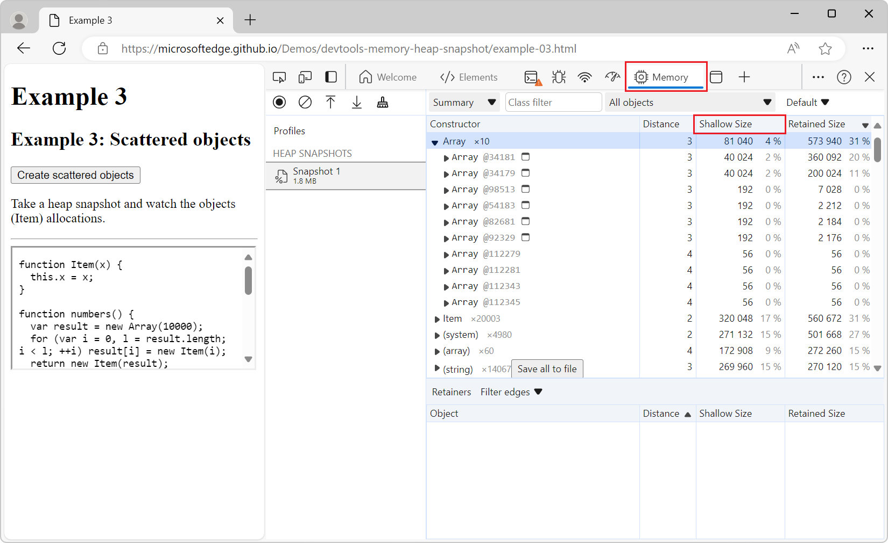
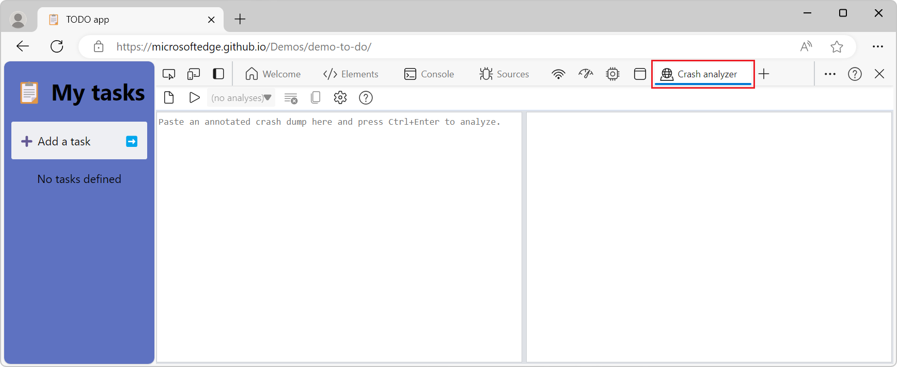

# What's New in DevTools (Microsoft Edge 123)

[!INCLUDE [Microsoft Edge team note for top of What's New](../../includes/edge-whats-new-note.md)]

<!-- ====================================================================== -->
## New experiment: Memory tool will report backing store sizes as part of an object's shallow size.

<!-- Subtitle: New experiment is available to make Shallow Size column in the Memory tool more helpful. -->

Heap snapshots in the Memory tool show a complete list of everything allocated in the V8 and Blink heaps. However, sometimes that list is a little too fine-grained: for example, it represents each JavaScript Array instance separately from the contents of that Array, which are called (object elements)[]. However, an Array from the perspective of JavaScript code is a single thing, not two. The same problem applies to properties in JavaScript objects, and the contents of Map and Set instances.

In Microsoft Edge 123, we've added a new experiment called "In heap snapshots, treat backing store size as part of the containing object." If you enable this option, then the Memory tool will report shallow sizes in a way that more closely matches JavaScript behavior. For example, you could sort Array​ instances by shallow size to find the largest arrays, as depicted below.

Default behaviour for heap snapshot:

Heap snapshot with the new experiment enabled:

<!-- ====================================================================== -->
## Crash analyzer tool is available by default

<!-- Subtitle: The Crash analyzer tool has been moved out of DevTools Experiements and is available under More Tools on the Activity Bar. -->

Starting with Microsoft Edge 123, the Crash analyzer tool is now available by default and no longer an experiment that needs to be enabled. This tool helps you take a JavaScript stack trace and applies your sourcemaps to the stack trace so that you can debug faster. You can access this tool by going to the More tools menu in the Activity Bar.

<!-- ====================================================================== -->
## Command Palette is deprecated

<!-- Subtitle: Starting with Microsoft Edge 123, the Command Palette experiment has been removed. -->

The Command Palette experimental feature will be removed from Microsoft Edge, starting with version 123.

<!-- ====================================================================== -->
## DevTools no longer loses focus while inspecting a page

<!-- Subtitle: In recent versions of Microsoft Edge, DevTools would lose focus while inspecting a page. In Microsoft Edge 123, this issue has been resolved. -->

There was a bug with inspecting and element on a webpage when DevTools was undocked. When selecting an element to inspect, the DevTools window would lose focus and would be obscured by the webpage. This bug has been resolved and the DevTools window will stay in focus and the topmost window.

<!-- ====================================================================== -->
## Announcements from the Chromium project

Microsoft Edge 123 also includes the following updates from the Chromium project:

<!-- ====================================================================== -->
<!-- uncomment if content is copied from developer.chrome.com to this page -->

<!-- > [!NOTE]
> Portions of this page are modifications based on work created and [shared by Google](https://developers.google.com/terms/site-policies) and used according to terms described in the [Creative Commons Attribution 4.0 International License](https://creativecommons.org/licenses/by/4.0).
> The original page for announcements from the Chromium project is [What's New in DevTools (Chrome 122)](https://developer.chrome.com/blog/new-in-devtools-122) and is authored by [Sofia Emelianova](https://developers.google.com/web/resources/contributors) (Senior Technical Writer working on Chrome DevTools at Google). -->

<!-- ====================================================================== -->
<!-- uncomment if content is copied from developer.chrome.com to this page -->

<!-- 
This work is licensed under a [Creative Commons Attribution 4.0 International License](https://creativecommons.org/licenses/by/4.0). -->
