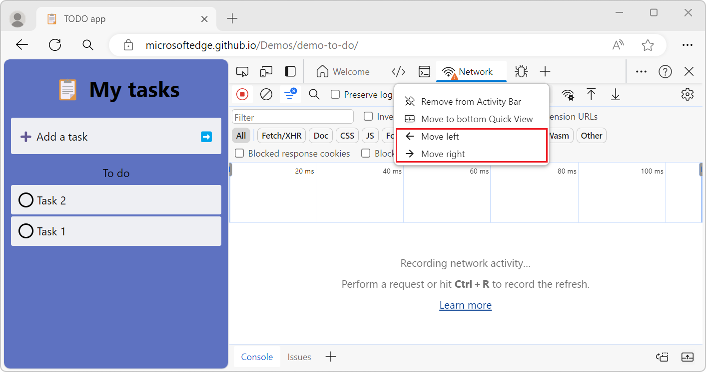
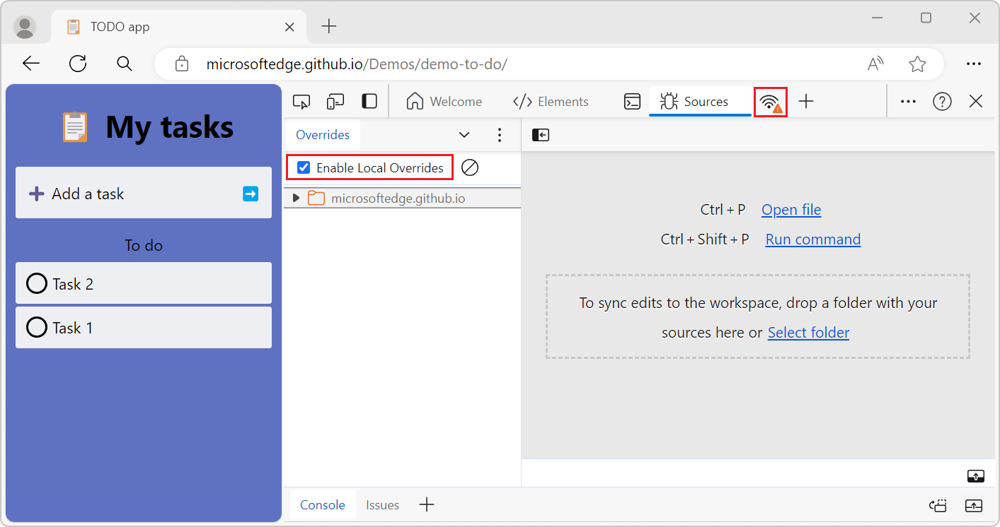
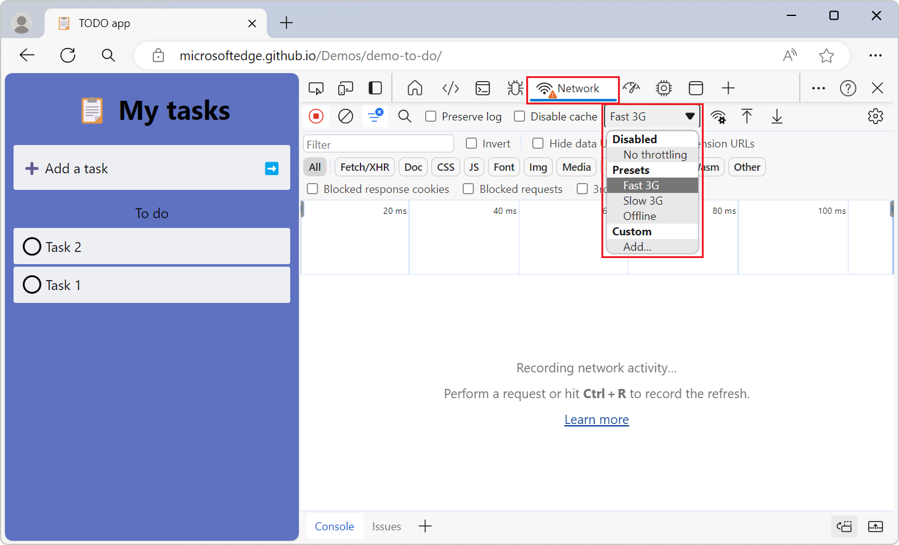

# What's New in DevTools (Microsoft Edge 124)

[!INCLUDE [Microsoft Edge team note for top of What's New](../../includes/edge-whats-new-note.md)]

<!-- ====================================================================== -->
## postMessage events and handlers are distinguished from other events on the timeline

<!-- Subtitle: Easily investigate performance issues related to posting messages across various threads in applications.  -->

A new experiment improves the **Performance** tool's timeline to help you quickly identify `postMessage` events and handlers, by distinguishing `postMessage` events from other timeline events.  Before, `postMessage` dispatch events and handler events both appeared as generic scripting function call events.  Now:
* `postMessage` dispatch events appear on the timeline as **Schedule postMessage**.
* `postMessage` handler events appear on the timeline as **On Message**.

The performance timeline has been updated to help you investigate when a `postMessage` call occurred, and how long the message was queued before the handler starts.  The dispatch events are linked to handler events by initiator arrows that appear when you click on either type of event:

To use this feature, in DevTools, select **Customize and control DevTools** () > **Settings** > **Experiments**, select the checkbox **Timeline: Show postMessage dispatch and handling flows**, click the **Close** (X) button, and then click the **Reload DevTools** button.

See also:
* [Timeline event reference](/microsoft-edge/devtools-guide-chromium/evaluate-performance/performance-reference)

<!-- ====================================================================== -->
## Move a tab left or right in the Activity bar by right-clicking it

<!-- Subtitle: Move the tabs in the Activity bar left or right by using the tab's right-click menu. -->

Before Microsoft Edge 124, you could rearrange the tabs in the **Activity bar** only by dragging them.  This can be difficult for users who are using input devices such as a trackball or head pointer.  Now, you can also move a tab left or right by right-clicking the tab and then selecting **Move left** or **Move right**:

See also:
* [Pin and rearrange tools in the Activity Bar](/microsoft-edge/devtools-guide-chromium/overview#pin-and-rearrange-tools-in-the-activity-bar) in _Overview of DevTools_.

<!-- todo: update png https://learn.microsoft.com/en-us/microsoft-edge/devtools-guide-chromium/about-tools-images/move-from-quickview-to-activitybar.png in section https://learn.microsoft.com/en-us/microsoft-edge/devtools-guide-chromium/about-tools#activity-bar-tools-vs-quick-view-tools -->

<!-- todo: in section https://learn.microsoft.com/en-us/microsoft-edge/devtools-guide-chromium/overview#pin-and-rearrange-tools-in-the-activity-bar state how to rearrange tool tabs within a toolbar -->

<!-- todo: update right-click menu in png https://learn.microsoft.com/en-us/microsoft-edge/devtools-guide-chromium/overview-images/remove-tool.png in section https://learn.microsoft.com/en-us/microsoft-edge/devtools-guide-chromium/overview#pin-and-rearrange-tools-in-the-activity-bar -->

<!-- ====================================================================== -->
## Network tab shows a warning icon when using overrides or throttling

<!-- Subtitle: Previously, this only worked in DevTools' legacy UI, but it's been fixed to work in the new UI now. -->

When you enable local overrides in the **Sources** tool, or when you turn on throttling in the **Network** tool, the **Network** tab now displays a warning icon:

See also:
* [Override webpage resources with local copies (Overrides tab)](/microsoft-edge/devtools-guide-chromium/javascript/overrides)
* [Emulate slow network connections](/microsoft-edge/devtools-guide-chromium/network/reference#emulate-slow-network-connections) in _Network features reference_.

<!-- ====================================================================== -->
## Announcements from the Chromium project

Microsoft Edge 124 also includes the following updates from the Chromium project:

* [New Autofill panel](https://developer.chrome.com/blog/new-in-devtools-124#autofill)
* [Enhanced network throttling for WebRTC](https://developer.chrome.com/blog/new-in-devtools-124#throttling)
* [Scroll-driven animations support in the Animations panel](https://developer.chrome.com/blog/new-in-devtools-124#animations)
* [Improved CSS nesting support in Elements > Styles](https://developer.chrome.com/blog/new-in-devtools-124#nested-css)
* [Enhanced Performance panel](https://developer.chrome.com/blog/new-in-devtools-124#perf)
   * [Hide functions and their children in the flame chart](https://developer.chrome.com/blog/new-in-devtools-124#hide-func)
   * [Arrows from selected initiators to events they initiated](https://developer.chrome.com/blog/new-in-devtools-124#event-initiators)
* [Tooltips for special categories in Memory > Heap snapshots](https://developer.chrome.com/blog/new-in-devtools-124#heap)
* [Application > Storage updates](https://developer.chrome.com/blog/new-in-devtools-124#storage)
   * [Bytes used for shared storage](https://developer.chrome.com/blog/new-in-devtools-124#shared-storage-bytes)
   * [Web SQL is fully deprecated](https://developer.chrome.com/blog/new-in-devtools-124#web-sql)
* [Coverage panel improvements](https://developer.chrome.com/blog/new-in-devtools-124#coverage)
* [JavaScript Profiler deprecation: Phase four, final](https://developer.chrome.com/blog/new-in-devtools-124#js-profiler)

<!-- ====================================================================== -->
<!-- uncomment if content is copied from developer.chrome.com to this page -->

<!-- > [!NOTE]
> Portions of this page are modifications based on work created and [shared by Google](https://developers.google.com/terms/site-policies) and used according to terms described in the [Creative Commons Attribution 4.0 International License](https://creativecommons.org/licenses/by/4.0).
> The original page for announcements from the Chromium project is [What's New in DevTools (Chrome 124)](https://developer.chrome.com/blog/new-in-devtools-124) and is authored by [Sofia Emelianova](https://developers.google.com/web/resources/contributors) (Senior Technical Writer working on Chrome DevTools at Google). -->

<!-- ====================================================================== -->
<!-- uncomment if content is copied from developer.chrome.com to this page -->

<!-- 
This work is licensed under a [Creative Commons Attribution 4.0 International License](https://creativecommons.org/licenses/by/4.0). -->
