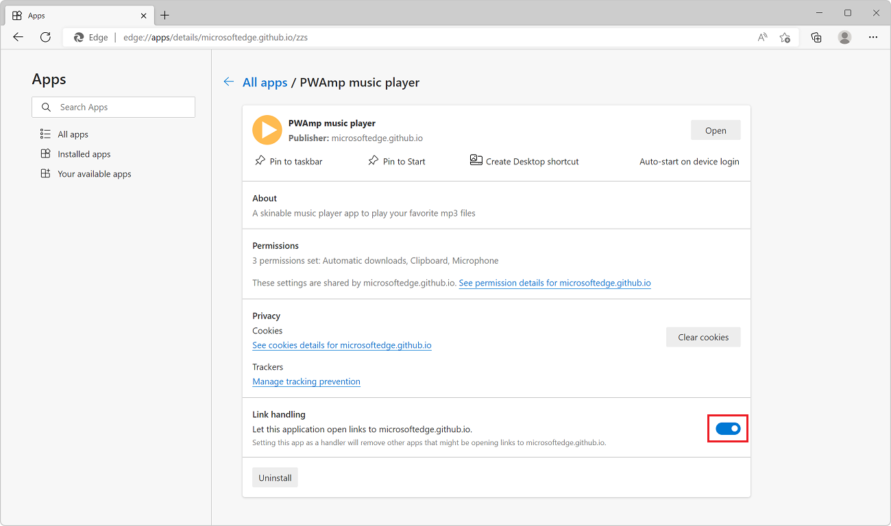

# Handle links to your Progressive Web Apps

Native applications on many operating systems can handle links. Native applications can request to be launched, instead of the web browser, when associated URLs are activated, to create a more engaging experience for these applications.

Progressive Web Apps (PWAs) can also handle links in a similar way.

<!-- ====================================================================== -->
## Automatic link handling

When Microsoft Edge is your default browser and you install a PWA using Microsoft Edge, all the links that refer to content that's within the scope of this PWA will automatically launch it instead of the web browser.

No code is required for automatic link handling to work, but end users can opt-out of automatic link handling. To opt-out of automatic link handling:

1. In Microsoft Edge, navigate to `edge://apps`.

1. Find the PWA you want to disable automatic link handling for and click **Details**.

1. On the PWA details page, under the **Link handling** section, click the toggle button.

<!-- ====================================================================== -->
## Handle links from other origins with scope extensions

The manifest of a PWA defines which part of the hosting domain the PWA is scoped to. For example, the `www.contoso.com` domain name may have a PWA defined under `www.contoso.com/app` with its scope set to `/app`. In this case, all the web pages available within the `www.contoso.com/app` path are part of the PWA scope. However the web pages within the `www.contoso.com/foo` path are not part of the PWA scope. Furthermore, web pages available at `bar.contoso.com/app` or `www.contoso.co.uk` are also not part of the PWA scope.

Scope extensions make it possible for a PWA to capture navigation to paths, subdomains, or even sites other than its own scope. This can be useful for PWAs that span multiple domains for localization purposes. For example, a PWA may span `contoso.com`, `contoso.co.uk`, and `contoso.fr`.

**Note**: The scope extensions feature is in active development and isn't ready to be used yet. To find out more about the state of development of this feature in Chromium, check out the [Web app scope extensions feature](https://chromestatus.com/feature/5746537956114432) at Chrome Platform Status.

Once the feature can be used in Microsoft Edge, we will document it here. In the meantime, to learn more about how scope extensions will work, see [the explainer document on the WICG repository](https://github.com/WICG/manifest-incubations/blob/gh-pages/scope_extensions-explainer.md).

<!-- ====================================================================== -->
## See also

*  [PWAs as URL Handlers](https://web.dev/pwa-url-handler/).
