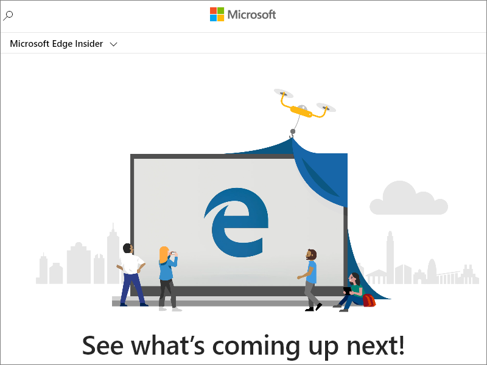

# Puppeteer overview

The [Puppeteer](https://pptr.dev) library provides a high-level API to control Chromium-based browsers, including Microsoft Edge, by using the [DevTools Protocol](https://chromedevtools.github.io/devtools-protocol).

Puppeteer launches [headless browsers](https://en.wikipedia.org/wiki/Headless_browser) by default.  Headless browsers don't display a user interface (UI), so you must use the command line.  You can also configure Puppeteer to run full (non-headless) Microsoft Edge.

By default, when you install Puppeteer, the installer downloads a recent version of [Chromium](https://www.chromium.org/Home), the open-source browser that [Microsoft Edge is also built upon](https://blogs.windows.com/windowsexperience/2018/12/06/microsoft-edge-making-the-web-better-through-more-open-source-collaboration).

If you have Microsoft Edge installed, you can use [puppeteer-core](https://pptr.dev/#?product=Puppeteer&version=v2.0.0&show=api-puppeteer-vs-puppeteer-core).  `puppeteer-core` is a lightweight version of Puppeteer that launches an existing browser installation, like Microsoft Edge.  To download Microsoft Edge, go to [Download Microsoft Edge Insider Channels](https://www.microsoft.com/edge/download/insider).

Puppeteer is a [Node](https://nodejs.org) library.


<!-- ====================================================================== -->
## Installing puppeteer-core

You can add `puppeteer-core` to your website or app by using one of the following commands:

```shell
npm i puppeteer-core
```

```shell
yarn add puppeteer-core
```


<!-- ====================================================================== -->
## Launch Microsoft Edge with puppeteer-core

`puppeteer-core` is similar to other browser-testing-frameworks, such as [WebDriver](../webdriver-chromium/index.md).  You create an instance of the browser, open a webpage, and then manipulate the webpage by using the Puppeteer API.

To use `puppeteer-core` to launch Microsoft Edge:

1.  `puppeteer-core` requires Node v8.9.0 or later.  Make sure you have a compatible version of Node.js.  To do this, run `node -v` from the command line.  Also, the example below uses `async`/`await`, which is only supported in Node v7.6.0 or later.

1.  In the following code sample, `puppeteer-core` launches Microsoft Edge, goes to `https://www.microsoft.com/edge/download/insider`, and saves a screenshot as `example.png`.  Copy the following code snippet and save it as `example.js`:

    ```javascript
    const puppeteer = require('puppeteer-core');
    
    (async () => {
      const browser = await puppeteer.launch({
        executablePath: 'C:\\Program Files (x86)\\Microsoft\\Edge Dev\\Application\\msedge.exe'
      });
      const page = await browser.newPage();
      await page.goto('https://www.microsoft.com/edge/download/insider');
      await page.screenshot({path: 'example.png'});
    
      await browser.close();
    })();
    ```
    
1.  Follow the next steps to find the executable path and then change `executablePath` to point to your installation of Microsoft Edge.  For example, on macOS, the `executablePath` for Microsoft Edge Canary should be set to `/Applications/Microsoft\ Edge\ Canary.app/`.

1.  To find the `executablePath`, a simple manual approach is to go to `edge://version` and copy the **Executable path** on that page.

1.  Or, to programmatically find the executable path, first install the [edge-paths](https://www.npmjs.com/package/edge-paths) package by running one of the following commands:

    ```shell
    npm i edge-paths
    ```
    
    ```shell
    yarn add edge-paths
    ```
    
1.  Then, if you're using `edge-paths` to find the executable path, run code like the following sample. It uses the [edge-paths](https://www.npmjs.com/package/edge-paths) package to programmatically find the path to your installation of Microsoft Edge on your OS:

    ```javascript
    const edgePaths = require("edge-paths");
    
    const EDGE_PATH = edgePaths.getEdgePath();
    ```
    
1.  Now that you've found the executable path (either manually or programmatically), in `example.js`, set `executablePath: EDGE_PATH`.  Save your changes.

1.  Run `example.js` from the command line:

    ```shell
    node example.js
    ```

    `puppeteer-core` launches Microsoft Edge, goes to `https://www.microsoft.com/edge/download/insider`, and saves a screenshot of the webpage.  You can customize the screenshot size by calling [page.setViewport()](https://pptr.dev/#?product=Puppeteer&version=v2.0.0&show=api-pagesetviewportviewport).

     The following `example.png` file is produced by `example.js`:

     

The preceding example demonstrates basic automation and testing scenarios that you can cover using Puppeteer and `puppeteer-core`.  For more information about Puppeteer and how it works, check out [Puppeteer](https://pptr.dev).


<!-- ====================================================================== -->
## See also

<!-- TODO: thin out? -->

#### Local articles

* [WebDriver](../webdriver-chromium/index.md)
* [Contact the Microsoft Edge DevTools team](../devtools-guide-chromium/contact.md) to send feedback about using Puppeteer, puppeteer-core, and Microsoft Edge.
* [Chrome DevTools Protocol (CDP)](../webview2/concepts/overview-features-apis.md#chrome-devtools-protocol-cdp) in _Overview of WebView2 features and APIs_
* [Use the Chrome DevTools Protocol (CDP) in WebView2 apps](../webview2/how-to/chromium-devtools-protocol.md)

#### Archive

* [WebDriver (EdgeHTML)](/archive/microsoft-edge/legacy/developer/webdriver/index)

#### Blog posts

* [Microsoft Edge:  Making the web better through more open source collaboration on Microsoft Experience Blog](https://blogs.windows.com/windowsexperience/2018/12/06/microsoft-edge-making-the-web-better-through-more-open-source-collaboration)

#### Tools

* [Download Microsoft Edge Insider Channels](https://www.microsoft.com/edge/download/insider)
* [Chromium on The Chromium Projects](https://www.chromium.org/Home)
* [Node.js](https://nodejs.org)
* [Puppeteer](https://pptr.dev)
* [puppeteer vs. puppeteer-core](https://pptr.dev/#?product=Puppeteer&version=v2.0.0&show=api-puppeteer-vs-puppeteer-core)
* [page.setViewport() on Puppeteer](https://pptr.dev/#?product=Puppeteer&version=v2.0.0&show=api-pagesetviewportviewport)

#### Protocols

* [Chrome DevTools Protocol Viewer](https://chromedevtools.github.io/devtools-protocol)

#### Info

* [Headless browser on Wikipedia](https://en.wikipedia.org/wiki/Headless_browser)
