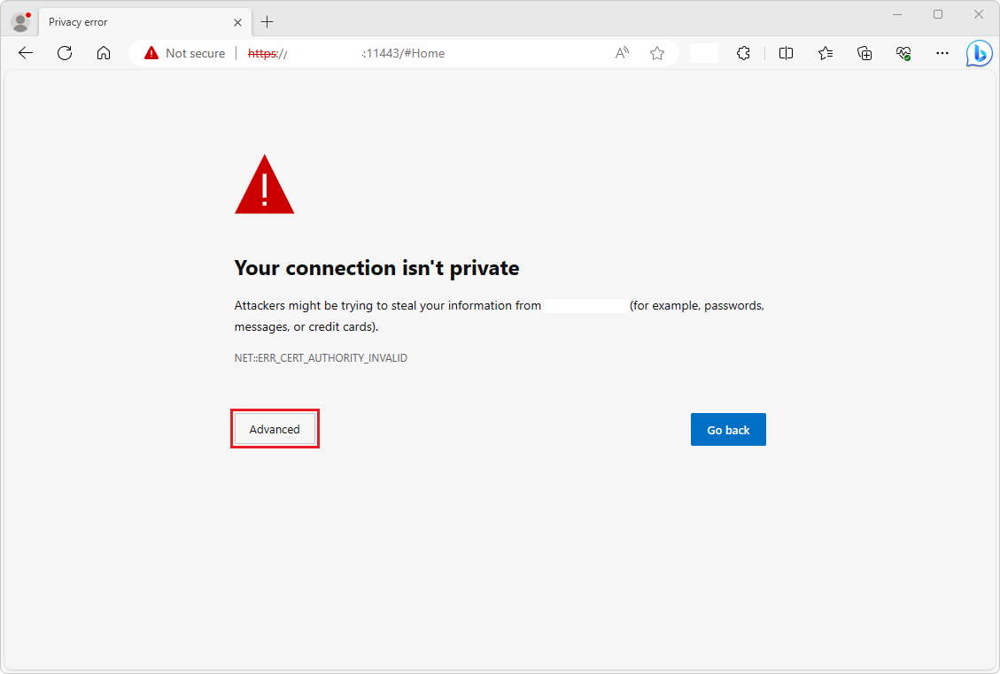
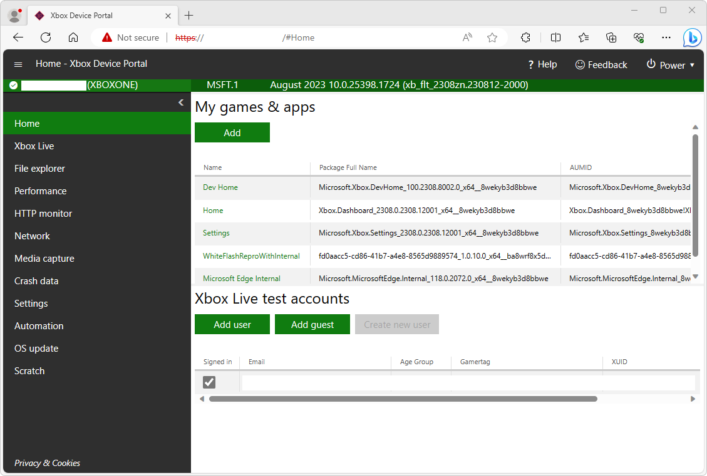
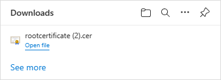
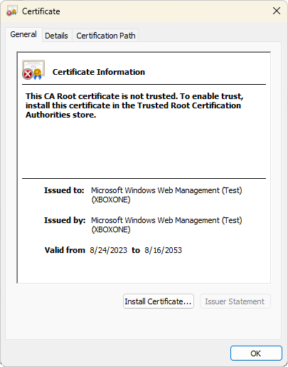
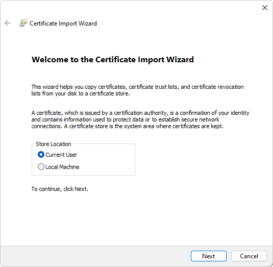
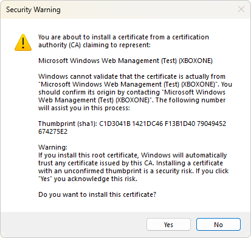
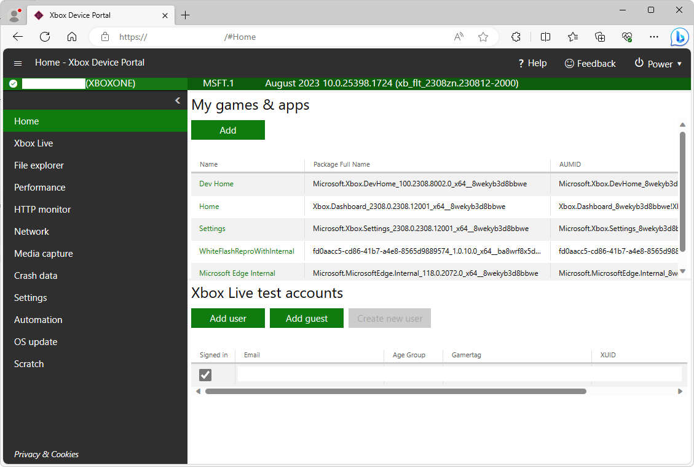

# Remote debugging Xbox WebView2 WinUI 2 (UWP) apps

To use [Microsoft Edge DevTools](/microsoft-edge/devtools-guide-chromium/landing/) to debug a WebView2 WinUI 2 (UWP) app, use remote debugging.  Remote debugging is necessary for WebView2 WinUI 2 (UWP) apps because currently, the built-in DevTools can't be launched inside a store-signed WebView2 WinUI 2 (UWP) app.


<!-- ========================================================================== -->
## Attach DevTools remotely to an Xbox WebView2 WinUI 2 (UWP) app

Attach Microsoft Edge DevTools remotely to an Xbox WebView2 WinUI 2 (UWP) app as follows:

1.  In Microsoft Edge, go to `edge://inspect`.  The **Inspect with Edge Developer Tools** page opens:

    

1.  Enable Developer Mode on Xbox.  See [Xbox One Developer Mode activation](/windows/uwp/xbox-apps/devkit-activation).

1.  In Microsoft Edge, go to `https://<System IP>:11443`, where `<System IP>` is replaced by your Xbox System OS IP.  The **Confirm security settings** page is displayed, in the **Windows Device Portal** tab:

    

    An SSL cert error appears:

    

1.  Click the **Advanced** button. <!--todo: state the system result-->

1.  Click **Continue**<!--todo: button?--> to `<System IP>`,<!--todo: clarify "Click Continue to System IP"--> where `<System IP>` is replaced by your Xbox System OS IP.

    Xbox Device Portal opens:

    

1.  Go to `https://<System IP>:11443/config/rootcertificate`, where `<System IP>` is replaced by your Xbox System OS IP.  This downloads a `rootcertificate.cer` file:

    

1.  Open the downloaded `rootcertificate.cer` file.  A security warning dialog box opens:

    

1.  Click the **Open** button.  A **Certificate** dialog opens:

    

1.  Click the **Install Certificate** button.  A **Welcome to the Certificate Import Wizard** dialog opens:

    

1.  Select the **Current User** option button, and then click the **Next** button.

    The Certificate Import Wizard opens:

    

1.  Select the option **Place all certificates in the following store**, click the **Browse** button, and then select **Trusted Root Certification Authorities**.

1.  Click the **Next** button.

    A **Security Warning** dialog opens:

    

1.  Click the **Yes** button.

1.  Restart Microsoft Edge.

1.  Go to `https://<System IP>:11443`, where `<System IP>` is replaced by your Xbox System OS IP, and verify that the connection is indicated as secure:<!--todo: clarify exactly how to verify that the connection is indicated as secure; and add red box on png.  do we mean https in Address bar? specify -->

    

1.  In your app project, set the following variable, to configure your WebView2 WinUI 2 (UWP) app for remote debugging.

    To enable remote debugging, an environment variable must be set in your project.  This variable must be set before creating the `CoreWebView2` instance, and before either setting the `WebView2.Source` property or calling the `WebView2.EnsureCoreWebView2Async` method.

    ```
    "WEBVIEW2_ADDITIONAL_BROWSER_ARGUMENTS", "--enable-features=msEdgeDevToolsWdpRemoteDebugging"
    ```
    
    For example, if you're using the [WebView2 Sample UWP app](https://github.com/MicrosoftEdge/WebView2Samples/tree/main/SampleApps/webview2_sample_uwp), you can set the environment variable by adding the following line in the `Browser.xaml.cs` file:
    
    ```csharp
    Environment.SetEnvironmentVariable("WEBVIEW2_ADDITIONAL_BROWSER_ARGUMENTS", "--enable-features=msEdgeDevToolsWdpRemoteDebugging");
    ```

    The line is numbered 33 in this screenshot, in the `Browser()` constructor, below an `#endif` that wraps an existing `SetEnvironmentVariable` statement:

    

1.  Deploy your app to your Xbox using `Xbox Device Portal` and launch your app.

1.  Go to `edge://inspect`.

1.  In the **Connect to a remote Windows device** text box, enter `https://<System IP>:11443`, where `<System IP>` is replaced by your Xbox System OS IP, and then click the **Connect to Device** button.

1.  Verify that you can successfully connect, so that your debuggable WebView2 control, named **Edge**, is listed under your machine name:

    

1.  At the bottom of the **Edge** WebView2 control entry, click the **inspect** link.

    Microsoft Edge DevTools opens for the WebView2 control:

    

Now you can use Microsoft Edge DevTools to inspect and debug the WebView2 control in your Xbox WebView2 WinUI 2 (UWP) app.


<!-- ========================================================================== -->
## See also

* [Remote debugging WebView2 WinUI 2 (UWP) apps](./remote-debugging.md)
